

## Universidad Peruana de Ciencias Aplicadas

  

### INFORME DE TRABAJO FINAL 

**Arquitecturas De Software Emergentes – NRC: 11821**

**Carrera de Ingeniería de Software** 

**Docente: Christian Luis De Los Rios Fernandez** 

**Nombre del startup: TechProtection** 

**Nombre del producto: GeoEntry**

<section class="members-section">
  <table>
    <thead>
      <tr>
        <th>Integrante</th>
        <th>Codigo</th>
      </tr>
    </thead>
    <tbody>
      <tr>
        <td>Eric Agama Espinoza</td>
        <td>U202213358</td>
      </tr>
      <tr>
        <td>Rodrigo Adrián López Huamán</td>
        <td>U202212338</td>
      </tr>
      <tr>
        <td>Merly Salon Puerta</td>
        <td>U20201b772</td>
      </tr>
      <tr>
        <td>Nicolas Alejandro Vera Nuñez</td>
        <td>U202214869</td>
      </tr>
      <tr>
        <td>Rodrigo Jesús Salvador Rodríguez</td>
        <td>U202213646</td>
      </tr>
    </tbody>
  </table>
</section>

<h3>Abril 2026</h3>
 

## Registro de Versiones

<section class="version-section">
  <table>
    <thead>
      <tr>
        <th>Versión</th>
        <th>Fecha</th>
        <th>Autor</th>
        <th>Descripción de la modificación</th>
      </tr>
    </thead>
    <tbody>
      <tr>
        <td>1.1</td>
        <td>18/04/2026</td>
        <td>TechProtection</td>
        <td>Capítulo I</td>
      </tr>
      <tr>
        <td>1.2</td>
        <td>19/04/2026</td>
        <td>TechProtection</td>
        <td>Capítulo II</td>
      </tr>
      <tr>
        <td>1.3</td>
        <td>22/04/2026</td>
        <td>TechProtection</td>
        <td>Capítulo III</td>
      </tr>
      <tr>
        <td>1.4</td>
        <td>24/04/2026</td>
        <td>TechProtection</td>
        <td>Capítulo IV</td>
      </tr>
    </tbody>
  </table>
</section>

## Report Collaboration Insights

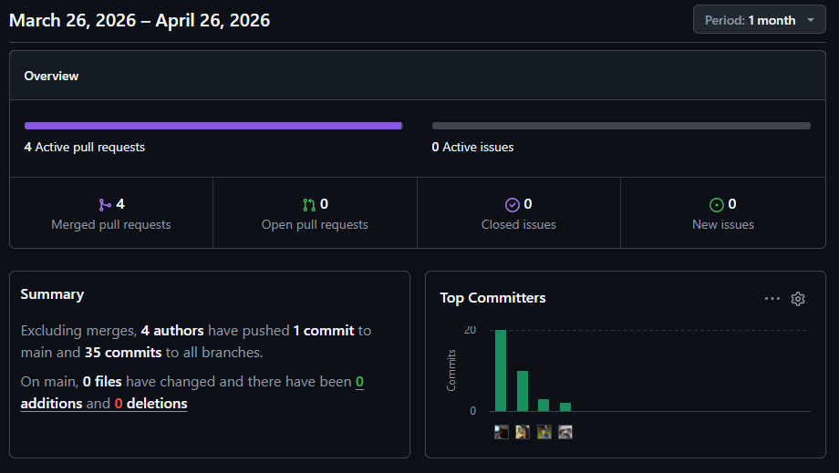

## Contenido
### Tabla de contenidos

- [Student Outcome](#student-outcome)
- [Capítulo I: Introducción](#capítulo-i-introducción)
  - [1.1. Startup Profile](#11-startup-profile)
    - [1.1.1. Descripción de la Startup](#111-descripción-de-la-startup)
    - [1.1.2. Perfiles de integrantes del equipo](#112-perfiles-de-integrantes-del-equipo)
  - [1.2. Solution Profile](#12-solution-profile)
    - [1.2.1 Antecedentes y problemática](#121-antecedentes-y-problemática)
    - [1.2.2 Lean UX Process.](#122-lean-ux-process)
      - [1.2.2.1. Lean UX Problem Statements.](#1221-lean-ux-problem-statements)
      - [1.2.2.2. Lean UX Assumptions.](#1222-lean-ux-assumptions)
      - [1.2.2.3. Lean UX Hypothesis Statements.](#1223-lean-ux-hypothesis-statements)
      - [1.2.2.4. Lean UX Canvas.](#1224-lean-ux-canvas)
  - [1.3. Segmentos objetivo.](#13-segmentos-objetivo)
- [Capítulo II: Requirements Elicitation & Analysis](#capítulo-ii-requirements-elicitation--analysis)
  - [2.1. Competidores.](#21-competidores)
    - [2.1.1. Análisis competitivo.](#211-análisis-competitivo)
    - [2.1.2. Estrategias y tácticas frente a competidores.](#212-estrategias-y-tácticas-frente-a-competidores)
  - [2.2. Entrevistas.](#22-entrevistas)
    - [2.2.1. Diseño de entrevistas.](#221-diseño-de-entrevistas)
    - [2.2.2. Registro de entrevistas.](#222-registro-de-entrevistas)
    - [2.2.3. Análisis de entrevistas.](#223-análisis-de-entrevistas)
  - [2.3. Needfinding.](#23-needfinding)
    - [2.3.1. User Personas.](#231-user-personas)
    - [2.3.2. User Task Matrix.](#232-user-task-matrix)
    - [2.3.3. Empathy Mapping.](#233-empathy-mapping)
    - [2.3.4. As-is Scenario Mapping.](#234-as-is-scenario-mapping)
  - [2.4. Ubiquitous Language.](#24-ubiquitous-language)
- [Capítulo III: Requirements Specification](#capítulo-iii-requirements-specification)
  - [3.1. To-Be Scenario Mapping.](#31-to-be-scenario-mapping)
  - [3.2. User Stories.](#32-user-stories)
  - [3.3. Impact Mapping.](#33-impact-mapping)
  - [3.4. Product Backlog.](#34-product-backlog)
- [Capítulo IV: Strategic-Level Software Design.](#capítulo-iv-strategic-level-software-design)
  - [4.1. Strategic-Level Attribute-Driven Design.](#41-strategic-level-attribute-driven-design)
    - [4.1.1. Design Purpose.](#411-design-purpose)
    - [4.1.2. Attribute-Driven Design Inputs.](#412-attribute-driven-design-inputs)
      - [4.1.2.1. Primary Functionality (Primary User Stories).](#4121-primary-functionality-primary-user-stories)
      - [4.1.2.2. Quality attribute Scenarios.](#4122-quality-attribute-scenarios)
      - [4.1.2.3. Constraints.](#4123-constraints)
    - [4.1.3. Architectural Drivers Backlog.](#413-architectural-drivers-backlog)
    - [4.1.4. Architectural Design Decisions.](#414-architectural-design-decisions)
    - [4.1.5. Quality Attribute Scenario Refinements.](#415-quality-attribute-scenario-refinements)
  - [4.2. Strategic-Level Domain-Driven Design.](#42-strategic-level-domain-driven-design)
    - [4.2.1. EventStorming.](#421-eventstorming)
    - [4.2.2. Candidate Context Discovery.](#422-candidate-context-discovery)
    - [4.2.3. Domain Message Flows Modeling.](#423-domain-message-flows-modeling)
    - [4.2.4. Bounded Context Canvases.](#424-bounded-context-canvases)
    - [4.2.5. Context Mapping.](#425-context-mapping)
  - [4.3. Software Architecture.](#43-software-architecture)
    - [4.3.1. Software Architecture System Landscape Diagram.](#431-software-architecture-system-landscape-diagram)
    - [4.3.1. Software Architecture Context Level Diagrams.](#432-software-architecture-context-level-diagrams)
    - [4.3.2. Software Architecture Container Level Diagrams.](#433-software-architecture-container-level-diagrams)
    - [4.3.3. Software Architecture Deployment Diagrams.](#433-software-architecture-deployment-diagrams)
- [Conclusiones](#conclusiones)
  - [Conclusiones y recomendaciones](#conclusiones-y-recomendaciones)
- [Bibliografía](#bibliografía)
- [Anexos](#anexos)

## Student Outcome 

<section class="outcome-section">
  <table>
    <thead>
      <tr>
        <th style="text-align: center;">Criterio específico</th>
        <th style="text-align: center;">Acciones realizadas</th>
        <th style="text-align: center;">Conclusiones</th>
      </tr>
    </thead>
    <tbody>
      <tr>
        <td style="vertical-align: top; width: 25%;"><strong>Comunica oralmente</strong> sus ideas y/o resultados con objetividad a público de diferentes especialidades y niveles jerárquicos, en el marco del desarrollo de un proyecto en ingeniería.</td>
        <td style="vertical-align: top;">
          <strong>Eric Agama Espinoza:</strong> 
          TB1: 
          Sustentó el <strong>Product Backlog</strong> y la <strong>User Task Matrix</strong>, explicando la prioridad de las tareas basada en la frecuencia de uso por parte de los segmentos objetivo.  
          <strong>Rodrigo Adrián López Huamán:</strong> 
          TB1: 
          Expuso las decisiones de arquitectura basadas en el <strong>Strategic-Level Attribute-Driven Design</strong>, justificando el uso de Ollama para la privacidad de datos.  
          <strong>Merly Salon Puerta:</strong> 
          TB1: 
          Presentó el <strong>Lean UX Canvas</strong> y las <strong>Hypothesis Statements</strong>, detallando la relación entre las necesidades del usuario y las soluciones propuestas.  
          <strong>Nicolas Alejandro Vera Nuñez:</strong> 
          TB1: 
          Explicó los diagramas de arquitectura de software (<strong>System Landscape y Context Level</strong>), detallando las interacciones entre microservicios.  
          <strong>Rodrigo Jesús Salvador Rodríguez:</strong> 
          TB1: 
          Sustentó el <strong>Análisis Competitivo</strong> y el <strong>Impact Mapping</strong>, resaltando las tácticas estratégicas para diferenciar a la startup en el mercado.
        </td>
        <td style="vertical-align: top; width: 25%;">
          Se logró alinear las expectativas del equipo sobre el orden de implementación técnica según el valor de negocio. Se comunicó con éxito cómo los drivers arquitectónicos mitigan los riesgos de seguridad y se demostró capacidad para validar suposiciones de diseño mediante una narrativa lógica. Finalmente, se estableció una base clara para el entendimiento técnico de la interoperabilidad del sistema y su posicionamiento estratégico en el mercado.
        </td>
      </tr>
      <tr>
        <td style="vertical-align: top;"><strong>Comunica en forma escrita</strong> ideas y/o resultados con objetividad a público de diferentes especialidades y niveles jerárquicos, en el marco del desarrollo de un proyecto en ingeniería.</td>
        <td style="vertical-align: top;">
          <strong>Eric Agama Espinoza:</strong> 
          TB1: 
          Documentó el <strong>Ubiquitous Language</strong> y el <strong>Product Backlog</strong>, asegurando una terminología consistente entre el negocio y la especificación técnica.  
          <strong>Rodrigo Adrián López Huamán:</strong> 
          TB1: 
          Redactó los <strong>Quality Attribute Scenario Refinements</strong> y el <strong>Context Mapping</strong>, definiendo formalmente las relaciones entre Bounded Contexts.  
          <strong>Merly Salon Puerta:</strong> 
          TB1: 
          Desarrolló los <strong>User Personas</strong> y el <strong>Empathy Mapping</strong>, traduciendo los hallazgos de las entrevistas en perfiles de usuario accionables.  
          <strong>Nicolas Alejandro Vera Nuñez:</strong> 
          TB1: 
          Elaboró los <strong>Bounded Context Canvases</strong> y los diagramas de contenedores y despliegue (<strong>C4 Model</strong>), detallando la infraestructura en Railway.  
          <strong>Rodrigo Jesús Salvador Rodríguez:</strong> 
          TB1: 
          Documentó el <strong>Lean UX Problem Statements</strong> y el <strong>To-Be Scenario Mapping</strong>, plasmando la visión futura de la interacción del usuario con el sistema.
        </td>
        <td style="vertical-align: top;">
          Se proveyó un lenguaje común escrito que redujo la ambigüedad en la especificación de requerimientos. La documentación técnica producida es precisa y sirve como guía normativa para el desarrollo de microservicios. Se garantizó que la problemática y la solución estuvieran documentadas con rigor técnico, permitiendo una implementación sin errores de interpretación y sintetizando procesos complejos en flujos de trabajo claros.
        </td>
      </tr>
    </tbody>
  </table>
</section>

## Capítulo I: Introducción

### 1.1 Startup Profile

### 1.1.1. Descripción de la Startup

La startup TechProtection surge con el objetivo de transformar la interacción entre las personas y sus espacios mediante el uso de tecnologías emergentes como el Internet de las Cosas (IoT) y la Inteligencia Artificial (IA). En un contexto donde los sistemas de automatización del hogar aún presentan altos niveles de fragmentación y requieren intervención manual constante, TechProtection propone una solución integral, inteligente y adaptativa.

El producto principal, GeoEntry, es un sistema de automatización inteligente que permite gestionar dispositivos del hogar como cerraduras electrónicas, sistemas de iluminación y climatización de manera automática y personalizada. A través del uso de dispositivos basados en ESP32 y sensores, el sistema detecta la proximidad del usuario y ejecuta acciones en tiempo real.

A diferencia de soluciones tradicionales, GeoEntry incorpora algoritmos de aprendizaje que analizan patrones de comportamiento del usuario, permitiendo anticipar sus necesidades y automatizar acciones sin intervención manual. De esta manera, el sistema no solo reacciona, sino que aprende y se adapta continuamente, optimizando la experiencia del usuario y promoviendo la eficiencia energética.

La propuesta de valor de TechProtection se centra en ofrecer un entorno inteligente capaz de adaptarse dinámicamente a los hábitos del usuario, brindando comodidad, seguridad y control en un solo ecosistema integrado.

Misión:
Desarrollar soluciones inteligentes basadas en IoT e Inteligencia Artificial que automaticen y optimicen la interacción de las personas con sus espacios, mejorando su calidad de vida.

Visión:
 Convertirse en una startup líder en soluciones de automatización inteligente en Latinoamérica, destacando por su innovación, adaptabilidad y enfoque centrado en el usuario.

### 1.1.2. Perfiles de integrantes del equipo

<section class="team-section">
<table>
  <thead>
    <tr>
      <th>Miembros</th>
      <th>Código estudiante</th>
      <th>Carrera</th>
      <th>Descripción</th>
    </tr>
  </thead>
  <tbody>
    <tr>
      <td>Agama Espinoza, Eric Fabricio</td>
      <td>u202213358</td>
      <td>Ingeniería de Software</td>
      <td>Soy Eric Agama, estudiante de Ingeniería de Software. Me caracterizo por ser responsable y comprometido en mis trabajos, y siempre busco optimizar la organización dentro del equipo. Tengo experiencia con el lenguaje Luau en Roblox Studio.</td>
    </tr>
    <tr>
      <td>López Huamán, Rodrigo Adrián</td>
      <td>U202212338</td>
      <td>Ingeniería de Software</td>
      <td>Mi nombre es Rodrigo Adrián López Huamán, estudiante de noveno ciclo de Ingeniería de Software, tengo 20 años y me considero un chico responsable y comprometido con mis actividades. Además, de ser una persona creativa y capaz de trabajar en equipo para alcanzar nuestras metas. También tengo habilidades en el manejo de conflictos, lo que me permite resolver situaciones difíciles de manera efectiva. Estoy emocionado de seguir aprendiendo y creciendo en esta carrera.</td>
    </tr>
    <tr>
      <td>Salvador Rodríguez, Rodrigo Jesús</td>
      <td>U202213646</td>
      <td>Ingeniería de Software</td>
      <td>Mi nombre es Rodrigo Jesus Salvador Rodriguez, tengo 20 años, estudio la carrera de Ingeniería de Software en la Universidad Peruana de Ciencias Aplicadas (UPC). Me considero una persona responsable y puntual en todo tipo de aspectos, esto lo voy a ver reflejado en este proyecto, como miembro de este equipo me comprometo a seguir las indicaciones al pie de la letra, seguir recomendaciones y apoyar siempre a mis compañeros para presentar el mejor proyecto grupal.</td>
    </tr>
    <tr>
      <td>Salon Puerta, Merly</td>
      <td>u20201b772</td>
      <td>Ingeniería de Software</td>
      <td>Mi nombre es Merly Salon, estudiante de Ingeniería de Software. Me considero una persona entusiasta. Pienso que todo lo que nos proponemos, se puede lograr con esfuerzo, constancia y disciplina. Lo que más me gusta de la ingeniería de software es que puedes crear soluciones tecnológicas que impacten positivamente en la sociedad.</td>
    </tr>
    <tr>
      <td>Nicolas Alejandro Vera Nuñez</td>
      <td>u202214869</td>
      <td>Ingeniería de Software</td>
      <td>Mi nombre es Nicolas Vera, estudiante de Ingeniería de Software, tengo 22 años y me considero una persona disciplinada y enfocada en alcanzar mis objetivos. En el área de Ingeniería de Software, me interesa el desarrollo de aplicaciones, el diseño de soluciones tecnológicas y el aprendizaje continuo de nuevas herramientas y metodologías, lo que me permite fortalecer mis habilidades y crecer profesionalmente en este campo.</td>
    </tr>
  </tbody>
</table>
</section>

### 1.2. Solution Profile

#### 1.2.1 Antecedentes y problemática

**1.2.1.1. What/Qué**
¿Cuál es el problema?
En la actualidad, muchas personas no cuentan con un sistema automatizado que les permita disfrutar de una experiencia cómoda, segura y eficiente al llegar a sus hogares. La falta de integración entre dispositivos inteligentes y la ausencia de activación automática basada en geolocalización provocan que los usuarios deban interactuar manualmente con múltiples sistemas (cerraduras, luces, temperatura, fragancias), lo cual disminuye la comodidad y afecta la eficiencia energética del hogar.

**1.2.1.2. Why/Por qué**
¿Cuál es la causa del problema?
La causa principal radica en la fragmentación del ecosistema de dispositivos inteligentes y en la falta de soluciones que utilicen geolocalización en tiempo real para activar funciones del hogar. A esto se suma que muchas personas desconocen el potencial de automatización contextual y continúan usando métodos manuales poco eficientes.

**1.2.1.3. Who/Quién**
¿Quiénes están involucrados?
Están involucrados instaladores de domótica, desarrolladores de viviendas inteligentes, y eventualmente, empresas del rubro inmobiliario que deseen incluir esta tecnología como valor agregado.

¿Quién lo utilizará?
Los usuarios principales del sistema son personas con estilo de vida activo, profesionales y familias que buscan mayor comodidad y eficiencia en la gestión de su hogar.

**1.2.1.4. When/Cuándo**
¿Cuándo sucede el problema?
El problema se manifiesta especialmente en momentos en los que los usuarios llegan a casa cargados, con poco tiempo, o simplemente desean una bienvenida más personalizada. La falta de automatización inteligente obliga a realizar múltiples acciones manuales para adaptar el ambiente del hogar, lo cual resulta poco práctico en la rutina diaria.

**1.2.1.5. Where/Dónde**
¿A dónde se dirige?
El problema surge principalmente en zonas urbanas y residenciales, especialmente a personas con interés en hogares inteligentes, tecnología y confort, ofreciendo una solución unificada que optimiza su estilo de vida.

¿Dónde surge el problema?
Este problema es común en este segmento del mercado, donde los usuarios ya cuentan con dispositivos inteligentes, pero carecen de una integración automatizada que funcione en función de la proximidad del usuario.

**1.2.1.6. How/Cómo**
¿Cómo se utilizará el producto?
El usuario instalará la app de GeoEntry en su smartphone. Al detectar que el usuario se aproxima a su vivienda, el sistema activará automáticamente funciones configuradas previamente como el desbloqueo de la puerta, el encendido de luces, el ajuste del clima interior y la liberación de fragancias ambientales. Todo esto estará conectado a través de una red domótica y gestionado desde la app.

¿Cómo lograremos la correcta integración del sistema?
GeoEntry integrará sensores de luminicidad, cerraduras electrónicas, controladores de clima, aromatizadores y geolocalización mediante una interfaz intuitiva. Los dispositivos se conectarán vía Wi-Fi o Bluetooth, y se podrá configurar rutinas según las preferencias del usuario, todo respaldado por protocolos de seguridad digital.

**1.2.1.7. How much/Cuánto**
¿Cuál es la magnitud del problema?
Según datos de Statista (2023), el mercado global de hogares inteligentes alcanzó los USD 126 mil millones en 2022, y se proyecta un crecimiento sostenido del 11% anual. En América Latina, el interés en soluciones de automatización sigue en aumento. GeoEntry se posiciona como una solución innovadora en un sector con gran potencial. Se estima que al menos un 30-40% de los hogares con acceso a internet y dispositivos inteligentes podrían beneficiarse con la propuesta de valor de GeoEntry en los próximos cinco años.

¿Qué porcentaje del personal de la industria se verá beneficiado por el servicio?
Se estima que entre un 45% y 65% del personal vinculado a la administración, seguridad y mantenimiento de viviendas unifamiliares y conjuntos residenciales podría beneficiarse del uso de GeoEntry.

#### 1.2.2 Lean UX Process.

##### 1.2.2.1.      Lean UX Problem Statements.

El propósito de GeoEntry es ofrecer una experiencia de automatización inteligente que reduzca la intervención manual del usuario y optimice la gestión del hogar mediante el uso de IoT e Inteligencia Artificial.

El problema actual radica en que los sistemas de domótica existentes presentan fragmentación, baja integración y ausencia de aprendizaje adaptativo, lo que obliga a los usuarios a configurar manualmente sus dispositivos y limita la personalización de la experiencia.

¿Cómo podríamos desarrollar un sistema de automatización del hogar que integre múltiples dispositivos y sea capaz de aprender del comportamiento del usuario para anticipar sus necesidades sin intervención manual?

##### 1.2.2.2. Lean UX Assumptions.

Business Assumptions

- Creemos que los usuarios valoran la automatización inteligente que reduzca la interacción manual.
- Creemos que la integración de múltiples dispositivos en una sola plataforma mejora la experiencia del usuario.
- Creemos que la incorporación de Inteligencia Artificial generará un valor diferencial frente a soluciones tradicionales.
- Creemos que los usuarios estarán dispuestos a invertir en soluciones que mejoren su comodidad, seguridad y eficiencia energética.
- Creemos que el modelo de negocio puede basarse en venta de hardware + servicios inteligentes.

User Assumptions
- Los usuarios desean simplificar la gestión de sus dispositivos inteligentes.
- Los usuarios prefieren sistemas automáticos en lugar de control manual constante.
- Los usuarios valoran la personalización basada en sus hábitos.
- Los usuarios tienen preocupaciones sobre complejidad, seguridad y compatibilidad.

Feature Assumptions
- El sistema debe detectar la proximidad del usuario.
- Debe automatizar dispositivos en tiempo real.
- Debe aprender patrones de comportamiento.
- Debe permitir personalización de escenarios.
- Debe ser fácil de configurar y usar. 

##### 1.2.2.3. Lean UX Hypothesis Statements.

**Hypothesis Statement 1:**

Creemos que los usuarios interesados en hogares inteligentes (jóvenes profesionales, familias tecnológicas o personas con rutinas definidas) estarán dispuestos a adoptar GeoEntry para automatizar su hogar mediante la integración de dispositivos IoT y detección de proximidad en tiempo real.

Sabremos que hemos tenido éxito
 Cuando al menos el 70% de los usuarios registrados configuren y utilicen al menos una automatización basada en proximidad dentro de los primeros 30 días de uso.

**Hypothesis Statement 2:**

Creemos que la incorporación de Inteligencia Artificial en GeoEntry permitirá a los usuarios reducir la necesidad de interacción manual, al automatizar acciones basadas en el aprendizaje de sus hábitos y patrones de comportamiento.

Sabremos que hemos tenido éxito
 Cuando al menos el 60% de las acciones ejecutadas por el sistema se realicen de forma automática sin intervención directa del usuario durante el primer mes de uso.

**Hypothesis Statement 3:**

Creemos que los usuarios valorarán la personalización inteligente del sistema, basada en el análisis de sus horarios y preferencias, lo que mejorará su experiencia dentro del hogar.

Sabremos que hemos tenido éxito
 Cuando al menos el 65% de los usuarios interactúen semanalmente con las configuraciones o recomendaciones del sistema para ajustar sus automatizaciones.

**Hypothesis Statement 4:**

Creemos que una interfaz intuitiva y fácil de usar facilitará la adopción de GeoEntry, incluso en usuarios sin experiencia previa en domótica.

Sabremos que hemos tenido éxito
 Cuando al menos el 85% de los usuarios completen correctamente la configuración inicial del sistema y el índice de abandono en la primera semana sea menor al 15%.

##### 1.2.2.4. Lean UX Canvas.

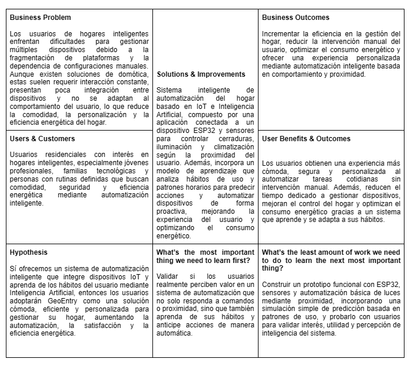
  

### 1.3. Segmentos objetivo.

El sistema GeoEntry está dirigido a usuarios que buscan mejorar la gestión de sus espacios mediante automatización inteligente basada en IoT e Inteligencia Artificial. Se identifican dos segmentos principales:

#### 1.3.1. Usuarios residenciales

Este segmento incluye a jóvenes profesionales y familias con interés en hogares inteligentes. Son usuarios que valoran la comodidad, la seguridad y la eficiencia energética, pero que actualmente enfrentan problemas como la fragmentación de dispositivos y la necesidad de interacción manual constante.

GeoEntry les permite integrar y automatizar sus dispositivos en una sola plataforma, incorporando inteligencia artificial para aprender de sus hábitos y anticipar acciones, mejorando así su experiencia diaria.

#### 1.3.2. Negocios

Este segmento está conformado por negocios como hoteles boutique, coworking y espacios de bienestar, que buscan mejorar la experiencia de sus clientes mediante automatización.

GeoEntry les permite optimizar procesos como el acceso, la iluminación y la climatización, además de ofrecer personalización basada en el comportamiento del usuario, generando valor agregado y diferenciación en el mercado.

## Capítulo II: Requirements Elicitation & Analysis

### 2.1 Competidores
#### 2.1.1 Análisis competitivo

Se realiza este análisis con el propósito de comprender el alcance de la solución propuesta y su posicionamiento frente a alternativas existentes, así como evaluar cómo la integración de tecnologías como IoT e Inteligencia Artificial en GeoEntry aporta valor diferencial en la automatización del hogar y en la optimización de la experiencia del usuario.

<h2>Análisis del Panorama Competitivo</h1>

<h2>Tabla Comparativa</h2>

<table class="competitive-analysis-table">
  <thead>
    <tr>
      <th colspan="2">Nombre de los Startups o Empresas</th>
      <th>GeoEntry</th>
      <th>Google Nest</th>
      <th>Samsung SmartThings</th>
      <th>Control4 (Snap One)</th>
    </tr>
  </thead>
  <tbody>
    <tr>
      <td rowspan="2" class="category-header">Perfil</td>
      <td>Overview</td>
      <td>GeoEntry utiliza sensores IoT que detectan cuando una persona ingresa a un espacio y activa automáticamente configuraciones personalizadas de iluminación, temperatura y seguridad. Intuitiva y fácil de instalar.</td>
      <td>Plataforma consolidada con dispositivos propios y compatibilidad con muchos productos de terceros. Usa aprendizaje automático para adaptarse a los hábitos del usuario.</td>
      <td>Ecosistema abierto y compatible con múltiples marcas. Su hub centraliza el control de dispositivos conectados y permite automatizaciones basadas en ubicación.</td>
      <td>Sistema profesional de alta gama con instalación profesional. Ofrece soluciones totalmente personalizadas para hogares de lujo y empresas con necesidades complejas.</td>
    </tr>
    <tr>
      <td>Ventaja competitiva ¿Qué valor ofrece a los clientes?</td>
      <td>Experiencia inmersiva completa al entrar al espacio sin necesidad de comandos. Solución modular y escalable que no requiere cambiar toda la infraestructura existente. Equilibrio entre facilidad de uso y personalización avanzada.</td>
      <td>Integración perfecta con el ecosistema Google, excelente reconocimiento de patrones y aprendizaje del comportamiento del usuario. Actualizaciones constantes y soporte a largo plazo.</td>
      <td>Gran compatibilidad con dispositivos de diferentes fabricantes. Precio más accesible y opciones de automatización basadas en la ubicación del usuario a través del smartphone.</td>
      <td>Soluciones completamente personalizadas de alto nivel con soporte profesional. Experiencia premium para clientes dispuestos a invertir en sistemas sofisticados.</td>
    </tr>
    <tr>
      <td rowspan="2" class="category-header">Perfil de Marketing</td>
      <td>Mercado objetivo</td>
      <td>Hogares de clase media-alta interesados en domótica y negocios pequeños-medianos (hoteles boutique, oficinas modernas, spas, estudios de yoga, coworkings) que buscan diferenciarse con experiencias personalizadas.</td>
      <td>Propietarios de viviendas con cierto poder adquisitivo, familias interesadas en seguridad y comodidad, usuarios ya integrados en el ecosistema Google.</td>
      <td>Propietarios e inquilinos con presupuesto más ajustado, usuarios que valoran la flexibilidad y quieren centralizar dispositivos de diferentes marcas.</td>
      <td>Propietarios de viviendas de lujo, hotelería premium, salas de conferencias corporativas y negocios exclusivos.</td>
    </tr>
    <tr>
      <td>Estrategias de marketing</td>
      <td>Contenido educativo, alianzas con diseñadores de interiores y arquitectos, demostraciones experienciales en showrooms de smart homes y ferias tecnológicas.</td>
      <td>Publicidad masiva, presencia en tiendas como Best Buy, promoción cruzada con otros productos Google, programa Works with Nest para desarrolladores.</td>
      <td>Partnerships con múltiples fabricantes, precio competitivo, comunidad activa de usuarios que comparten automatizaciones.</td>
      <td>Marketing exclusivo, presencia en ferias de construcción de lujo, alianzas con constructores y diseñadores de élite.</td>
    </tr>
    <tr>
      <td rowspan="3" class="category-header">Perfil de Producto</td>
      <td>Productos & Servicios</td>
      <td>Hardware: sensores de presencia, hub central, accesorios de conexión. Software: app móvil para configuración, plataforma cloud, APIs para integración. Servicios: asesoría de instalación, mantenimiento y actualizaciones.</td>
      <td>Línea completa de dispositivos smart home, servicio de almacenamiento en la nube Nest Aware, soporte técnico, actualizaciones regulares de software.</td>
      <td>Hub SmartThings, sensores variados, app móvil, plataforma cloud, marketplace de aplicaciones y servicios, comunidad para compartir automatizaciones.</td>
      <td>Sistema Control4 completo con componentes propios, servicios de diseño e instalación profesional, mantenimiento premium, actualizaciones y personalizaciones exclusivas.</td>
    </tr>
    <tr>
      <td>Precios & Costos</td>
      <td>Kit básico hogar: $249 (hub + 2 sensores). Kit negocio: $599 (hub + 5 sensores + software analítico). Sensores adicionales: $49/unidad. Suscripción opcional: $5.99/mes (análisis avanzado y backup).</td>
      <td>Termostato Nest: $249. Cámara Nest: $199-299. Timbre Nest: $229. Suscripción Nest Aware: $6-12/mes. Sin costos de instalación profesional obligatoria.</td>
      <td>Hub: $99. Sensores entre $20-60. Sin costos de suscripción obligatoria. Compatible con dispositivos económicos de diferentes marcas. </td>
      <td>Sistemas desde $5,000 hasta $50,000+ dependiendo de la complejidad. Instalación profesional obligatoria ($1,000+). Suscripción anual de mantenimiento recomendada.</td>
    </tr>
    <tr>
      <td>Canales de distribución(Web y/o Móvil)</td>
      <td>Web propia con e-commerce, Amazon, tiendas especializadas en smart home, alianzas con integradores de domótica, app móvil (iOS/Android) y aplicación web para gestión.</td>
      <td>Google Store, Amazon, Best Buy, Home Depot, instaladores autorizados. Control mediante app Nest/Google Home (iOS/Android).</td>
      <td>Tienda online propia, Amazon, Best Buy, Walmart. Control mediante app SmartThings (iOS/Android). </td>
      <td>Exclusivamente a través de distribuidores e instaladores autorizados. Venta consultiva con demostración previa. Control mediante app Control4 (iOS/Android) y paneles táctiles instalados.</td>
    </tr>
    <tr>
      <td rowspan="4" class="category-header">Análisis SWOT</td>
      <td>Fortalezas</td>
      <td> 1. Experiencia inmersiva "manos libres" sin necesidad de comandos.  2. Sistema modular y escalable.  3. Equilibrio entre facilidad de uso y personalización.  4. Compatible con múltiples ecosistemas existentes.  5. Precio competitivo para el valor ofrecido.</td>
      <td>1. Marca reconocida y respaldo de Google.  2. Productos de alta calidad y diseño atractivo.  3. Fuerte integración con asistentes virtuales.  4. Constantes actualizaciones y mejoras.  5. Amplia red de distribución.</td>
      <td>1. Gran compatibilidad con diferentes marcas.  2. Comunidad activa de usuarios.  3. Precios accesibles.  4. Plataforma abierta para desarrolladores.  5. Respaldo de Samsung.</td>
      <td>1. Calidad premium.  2. Personalización total.  3. Soluciones a medida para hogares y negocios.  4. Servicio completo (diseño, instalación, mantenimiento).  5. Experiencia en proyectos complejos.</td>
    </tr>
    <tr>
      <td>Debilidades</td>
      <td>1. Marca nueva sin reconocimiento en el mercado.  2. Red de distribución limitada.  3. Dependencia de fabricantes de dispositivos para integraciones.  4.  Equipo más pequeño que las grandes corporaciones.</td>
      <td>1. Precios elevados.  2.  Ecosistema cerrado que prioriza productos Google.  3. Necesidad de conexión a internet constante.  4.  Preocupaciones de privacidad por recopilación de datos.</td>
      <td>1. Experiencia de usuario menos pulida.  2.  Algunas automatizaciones requieren conocimientos técnicos.  3.  Menor reconocimiento de marca que Google.  4.  Soporte técnico limitado. </td>
      <td>1. Precios muy elevados.  2.  Instalación profesional obligatoria.  3. Dependencia del instalador para cambios.  - Menor flexibilidad para actualizaciones DIY  - Curva de aprendizaje pronunciada.</td>
    </tr>
    <tr>
      <td>Oportunidades</td>
      <td>1. Crecimiento del mercado de smart home y IoT.  2.  Aumento de conciencia sobre eficiencia energética  3.  Interés creciente en experiencias personalizadas  4.  Potencial para expandirse al sector hotelero y hospitalidad.</td>
      <td>1. Expansión del ecosistema Google Home.  2.  Integración con nuevos electrodomésticos inteligentes  3.  Alianzas con constructoras para instalaciones en nuevas viviendas  4.  Desarrollo de IA más avanzada.</td>
      <td>1. Crecimiento del mercado de dispositivos compatibles.  2.  Potencial para convertirse en el estándar de interoperabilidad  3.  Expansión internacional  4.  Nuevos acuerdos con fabricantes. </td>
      <td>1. Aumento de construcciones de lujo.  2.  Crecimiento del segmento de hoteles boutique  3.  Expansión a oficinas corporativas premium  4. Internacionalización a mercados emergentes de lujo.</td>
    </tr>
    <tr>
      <td>Amenazas</td>
      <td>1. Entrada de grandes tecnológicas al mismo nicho.  2.  Cambios en estándares de conectividad.  3. Preocupaciones sobre privacidad y seguridad.  4. Recesión económica que afecte el gasto en tecnología.</td>
      <td>1. Competencia creciente de Amazon y Apple.  2. Regulaciones de privacidad más estrictas.  3. Saturación del mercado premium.  4. Vulnerabilidades de seguridad.</td>
      <td>1. Posible consolidación del mercado.  2.  Competencia de soluciones propietarias más integradas.  3.  Cambios en la estrategia de Samsung.  4.  Problemas de compatibilidad con actualizaciones de terceros. </td>
      <td>1. Soluciones DIY cada vez más sofisticadas.  2.  Disminución en la demanda de instalaciones profesionales.  3.  Competencia de sistemas modulares más accesibles.  4. Cambios generacionales en preferencias de consumo.</td>
    </tr>
  </tbody>
</table>

#### 2.1.2 Estrategias y tácticas frente a competidores

| Competidores | ¿Qué se puede hacer para ganarle a la competencia? |
| --- | --- |
| Competidor 1: Google Nest | - Ofrecer una experiencia "manos libres" completamente automática, sin necesidad de comandos manuales.   - Posicionarse como la opción con mejor relación valor-precio en el segmento medio-alto, superando la oferta de Nest en accesibilidad y facilidad de uso.   - Desarrollar soluciones modulares que permitan a los usuarios comenzar con una inversión más baja y escalar gradualmente.   - Establecer alianzas estratégicas con arquitectos, diseñadores de interiores y constructoras para aumentar la visibilidad y el alcance en proyectos de viviendas inteligentes. |
| Competidor 2: SmartThings (Samsung) |  - Simplificar la instalación y gestión para hacerla accesible a usuarios menos técnicos, ofreciendo una experiencia intuitiva y sin fricciones.   - Mejorar la integración con dispositivos existentes para que los usuarios no necesiten reemplazar toda su infraestructura de hogar inteligente.   - Enfocar más en la personalización para negocios, como hoteles boutique y espacios comerciales, agregando valor a esos segmentos con características específicas.   - Fomentar una comunidad activa de usuarios que compartan configuraciones personalizadas y escenas para aumentar el valor de la plataforma a medida que crece. |
| Competidor 3: Control4 (Snap One) |  - Proporcionar una opción más accesible, enfocándose en la facilidad de uso y la reducción de la necesidad de instalación profesional obligatoria.   - Ofrecer precios más competitivos en comparación con Control4, haciendo que la tecnología avanzada sea más accesible para un público más amplio.   - Desarrollar un sistema modular que permita a los usuarios comenzar con una inversión pequeña y aumentar la escala a medida que se familiarizan con el sistema.   - Desarrollar propiedad intelectual alrededor de sus algoritmos de detección y personalización para proteger la tecnología y mantener una ventaja competitiva.|

### 2.2 Entrevistas

En la presente sección del informe se desarrollará el diseño, registro y análisis de las entrevistas dirigidas a los segmentos objetivo previamente identificados, con el fin de validar la pertinencia de la solución tecnológica propuesta.

#### 2.2.1 Diseño de entrevistas

Se han identificado los siguientes segmentos:
  - Usuarios residenciales con tecnología inteligente en el hogar.
  - Negocios interesados en implementar experiencias de bienvenida automatizadas.
 

Antes de llevar a cabo las entrevistas, se consideró necesario realizar un análisis preliminar orientado a comprender el contexto de uso de tecnologías de automatización, así como las principales limitaciones y expectativas de los usuarios frente a este tipo de soluciones. 
Este enfoque permitió estructurar adecuadamente el proceso de levantamiento de información, facilitando la formulación de preguntas alineadas con los componentes clave de GeoEntry, tales como la automatización basada en proximidad, la integración de dispositivos IoT y el uso de Inteligencia Artificial para el aprendizaje de patrones de comportamiento. 
En ese sentido, se elaboraron preguntas específicas para cada segmento con el propósito de identificar necesidades, problemáticas y percepciones relacionadas con el control de accesos, la personalización de entornos y la eficiencia en la gestión energética, aspectos fundamentales que la solución GeoEntry busca optimizar. 

##### Segmento: Hogares inteligentes (usuarios residenciales)
##### Principales:
1. **Introducción al Contexto**: ¿Podría describir qué tecnologías inteligentes tiene actualmente en su hogar y cómo las utiliza en su día a día?
2. **Experiencia Actual**: ¿Cómo es su experiencia al llegar a casa? ¿Qué acciones debe realizar manualmente que le gustaría automatizar?
3. **Desafíos y Frustraciones**: ¿Cuáles son los mayores inconvenientes o frustraciones que experimenta con la tecnología existente en su hogar?
4. **Prioridades y Valores**: ¿Qué aspectos valora más en su hogar: la comodidad, la seguridad, la eficiencia energética o la personalización del ambiente?
5. **Experiencias Previas**: ¿Ha intentado implementar algún sistema de automatización anteriormente? ¿Cuál fue su experiencia?
6. **Interacción Preferida**: ¿Prefiere controlar sus dispositivos mediante comandos de voz, aplicaciones móviles, o le gustaría que funcionaran automáticamente sin intervención?
7. **Preocupaciones**: ¿Qué preocupaciones tiene respecto a implementar más tecnologías inteligentes en su hogar (privacidad, complejidad, costo, etc.)?
8. **Disposición a Invertir**: ¿Qué presupuesto consideraría razonable para implementar un sistema que automatice su experiencia al llegar a casa?
9. **Expectativas de Resultados**: ¿Cómo imagina que sería la experiencia ideal al llegar a su hogar si pudiera personalizarla completamente?
10. **Decisión de Compra**: ¿Qué factores serían determinantes para que usted decidiera invertir en un nuevo sistema de automatización para su hogar?

 

#### Segmento: Negocios que buscan experiencias de bienvenida automatizadas
#### Principales:
1. **Contexto del Negocio**: ¿Podría describir su negocio y cómo es actualmente la experiencia de sus clientes o empleados al ingresar a su establecimiento?
2. **Objetivos de Experiencia**: ¿Qué tipo de primera impresión o experiencia de bienvenida le gustaría crear para las personas que ingresan a su establecimiento?
3. **Desafíos Actuales**: ¿Qué problemas o limitaciones enfrenta actualmente para ofrecer una experiencia de bienvenida personalizada y consistente?
4. **Tecnología Existente**: ¿Qué tecnologías o sistemas de automatización utiliza actualmente en su negocio? ¿Cuáles han sido sus resultados?
5. **Diferenciación Competitiva**: ¿Cómo cree que una experiencia de bienvenida automatizada podría ayudarle a diferenciarse de sus competidores?
6. **Impacto en Clientes**: ¿Qué tipo de comentarios o retroalimentación ha recibido de sus clientes respecto a la experiencia de entrada a su establecimiento?
7. **Expectativas de ROI**: ¿Qué retorno de inversión esperaría de implementar un sistema de bienvenida automatizado en términos de satisfacción del cliente, eficiencia operativa o ahorro energético?
8. **Presupuesto y Recursos**: ¿Qué presupuesto consideraría razonable para implementar una solución de este tipo? ¿Cuenta con personal que podría gestionar esta tecnología?
9. **Personalización y Control**: ¿Qué nivel de personalización y control necesitaría sobre las experiencias automatizadas para diferentes tipos de clientes o momentos del día?
10. **Factores de Decisión**: ¿Qué aspectos serían determinantes para que usted decidiera implementar una solución de bienvenida automatizada en su negocio (facilidad de uso, escalabilidad, compatibilidad con sistemas existentes, etc.)?

 

#### 2.2.2 Registro de entrevistas
A continuación se presentan los resúmenes de las entrevistas realizadas a representantes de nuestros dos segmentos objetivo. 

##### Segmento 1: Hogares inteligentes (usuarios residenciales)

| Entrevista 1 | Alejandro Barturen |
|------------------|----------------------|
| Edad         | 21 años              |
| Distrito     | San Miguel          |
| 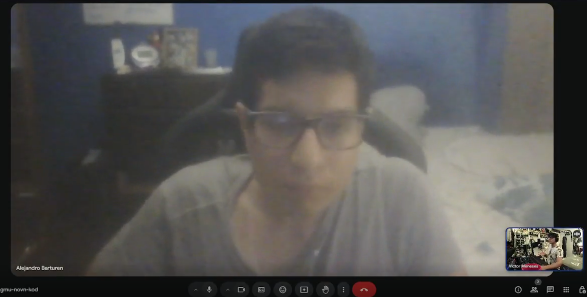  | - Resumen:   Cuenta con un ecosistema básico de hogar inteligente (luces y termostato inteligentes, cerradura inteligente). Busca principalmente automatizar el proceso de llegada a casa, eliminando la necesidad de buscar llaves, encender luces manualmente y ajustar la temperatura. Su principal frustración es la fragmentación de los sistemas que requieren múltiples aplicaciones. Valora la comodidad como prioridad principal, seguida de la eficiencia energética. Ha experimentado con automatizaciones básicas mediante IFTTT, pero las abandonó por la dificultad de adaptarlas a horarios variables. Prefiere soluciones que funcionen automáticamente según su ubicación y horarios, sin necesidad de comandos o aplicaciones. Expresa preocupaciones sobre privacidad y obsolescencia tecnológica. Dispuesto a invertir entre $500-700 inicialmente en un sistema que realmente funcione. Los factores determinantes para su decisión incluyen facilidad de instalación, compatibilidad con dispositivos existentes, confiabilidad y buen soporte técnico.|
| URL | [Link de la entrevista](https://upcedupe-my.sharepoint.com/:v:/g/personal/u202212191_upc_edu_pe/EWaFGrpWV4xApxird8jnfNIBsRNl3LYrlh1bVEhv8_Q5Mg?e=9x7JxC&nav=eyJyZWZlcnJhbEluZm8iOnsicmVmZXJyYWxBcHAiOiJTdHJlYW1XZWJBcHAiLCJyZWZlcnJhbFZpZXciOiJTaGFyZURpYWxvZy1MaW5rIiwicmVmZXJyYWxBcHBQbGF0Zm9ybSI6IldlYiIsInJlZmVycmFsTW9kZSI6InZpZXcifX0%3D)            |
 

| Entrevista 2 |  Steven Liu Li |
|------------------|----------------------|
| Edad         | 24 años              |
| Distrito     | San Miguel          |
|   | - Resumen:   Posee un sistema más orientado a la seguridad (cámaras conectadas, enchufes inteligentes y cortinas automáticas). Desea automatizar la desactivación del sistema de alarma, el encendido de luces y ajuste de temperatura al llegar a casa. Su principal frustración es la falta de integración entre dispositivos de diferentes marcas. Prioriza la seguridad sobre la comodidad, con especial interés en el monitoreo remoto. Ha expandido gradualmente su sistema mediante prueba y error. Prefiere una combinación de automatización basada en ubicación y control manual desde el teléfono. Sus principales preocupaciones incluyen la seguridad informática de los dispositivos y la resiliencia del sistema ante fallas eléctricas. Considera una inversión de $800-1000 para un sistema integral. Valora especialmente la seguridad informática, compatibilidad con dispositivos existentes y un buen soporte técnico.|
| URL | [Link de la entrevista](https://upcedupe-my.sharepoint.com/:v:/g/personal/u202212191_upc_edu_pe/EchLT4C3VYFEh-IPtMOirHgBedGcVkTbePxXf29lP59Dhg?e=5IuhUW&nav=eyJyZWZlcnJhbEluZm8iOnsicmVmZXJyYWxBcHAiOiJTdHJlYW1XZWJBcHAiLCJyZWZlcnJhbFZpZXciOiJTaGFyZURpYWxvZy1MaW5rIiwicmVmZXJyYWxBcHBQbGF0Zm9ybSI6IldlYiIsInJlZmVycmFsTW9kZSI6InZpZXcifX0%3D)            |
 

| Entrevista 3 |  Harold Mayta |
|------------------|----------------------|
| Edad         | 21 años              |
| Distrito     | Lince          |
|   | - Resumen:   Principiante en domótica con experiencia limitada a bombillas y parlantes inteligentes. Busca simplificar su rutina de llegada a casa, especialmente cuando tiene las manos ocupadas. Su principal desafío es no saber por dónde empezar ante las abrumadoras opciones del mercado. Valora la simplicidad y buena relación calidad-precio sobre características avanzadas. Ha encontrado complicada la configuración de rutinas automatizadas. Prefiere un equilibrio entre funciones automáticas y comandos de voz simples. Le preocupa principalmente la complejidad de instalación y configuración, así como la potencial obsolescencia. Dispuesto a realizar una inversión inicial modesta de $300-400 como prueba. Los factores decisivos incluyen facilidad de instalación y configuración, escalabilidad, y buen soporte para principiantes. |
| URL | [Link de la entrevista](https://upcedupe-my.sharepoint.com/:v:/g/personal/u202212191_upc_edu_pe/Ef1mZmoe1IhPqK2f1KDjgCcBLt2oHTY96O9FZXKflCoC6Q?e=ivDzYC&nav=eyJyZWZlcnJhbEluZm8iOnsicmVmZXJyYWxBcHAiOiJTdHJlYW1XZWJBcHAiLCJyZWZlcnJhbFZpZXciOiJTaGFyZURpYWxvZy1MaW5rIiwicmVmZXJyYWxBcHBQbGF0Zm9ybSI6IldlYiIsInJlZmVycmFsTW9kZSI6InZpZXcifX0%3D)            |
 

##### Segmento 2: Negocios que buscan experiencias de bienvenida automatizadas

| Entrevista 4 |  Jose Cuevas Vera |
|------------------|----------------------|
| Negocio         | Hotel boutique (15 habitaciones)              |
| Cargo     | Dueño y Gestor          |
|   | - Resumen:   Gestiona un hotel boutique donde la experiencia de llegada es tradicional, con check-in manual y llaves físicas. Desea crear una experiencia más personalizada con ajustes automáticos de ambiente y notificaciones para el personal con información relevante sobre cada huésped. Su principal desafío es la inconsistencia en la experiencia según el personal en turno. Cuenta con sistemas digitales de gestión hotelera, cerraduras con tarjeta y sonido centralizado, pero sin integración entre ellos. Ve en la automatización un diferenciador importante en su segmento de mercado. Los clientes han sugerido mejorar la eficiencia del check-in y personalización. Espera como retorno aumento en valoraciones positivas, mayor fidelización y ahorro energético. Dispuesto a invertir entre $5,000-8,000, con personal técnico básico para gestionar el sistema. Necesita flexibilidad para personalizar la experiencia según distintos perfiles de huéspedes. Los factores determinantes incluyen facilidad de integración con sistemas existentes, simplicidad de uso para el personal y buen soporte técnico. |
| URL | [Link de la entrevista](https://upcedupe-my.sharepoint.com/:v:/g/personal/u202212191_upc_edu_pe/EYDUf-6A7vtLoOxfVTENShABHeXudaaxe8F-KvkZjX5-Ew?e=EKU2Lq&nav=eyJyZWZlcnJhbEluZm8iOnsicmVmZXJyYWxBcHAiOiJTdHJlYW1XZWJBcHAiLCJyZWZlcnJhbFZpZXciOiJTaGFyZURpYWxvZy1MaW5rIiwicmVmZXJyYWxBcHBQbGF0Zm9ybSI6IldlYiIsInJlZmVycmFsTW9kZSI6InZpZXcifX0%3D)            |
 

| Entrevista 5 |  Nicolas Alejandro Vera |
|------------------|----------------------|
| Negocio         | Estudio de yoga y bienestar             |
| Cargo     | Dueño y Administrador          |
|   | - Resumen:   Dirige un estudio de yoga con tres salas diferentes donde el registro es manual y los ajustes de ambiente se realizan manualmente entre clases. Busca crear un ambiente más fluido donde los clientes frecuentes sean reconocidos automáticamente y dirigidos a salas ya configuradas según el tipo de clase. Su principal desafío es la transición entre clases y el registro de asistencia sin interrumpir la tranquilidad del espacio. Dispone de un sistema básico de reservas online y controles independientes no automatizados para iluminación y sonido. Ve la automatización como un diferenciador para posicionarse como estudio premium. Ha recibido algunas quejas sobre tiempos de espera en registro y configuraciones inadecuadas de salas. Espera mejorar la retención de clientes y reducir la carga administrativa. Con un presupuesto de $3,000-5,000 como pequeño negocio, necesita una solución intuitiva con buen soporte. Requiere poder configurar ambientaciones predefinidas para diferentes tipos de clases. Valora especialmente la simplicidad de uso, confiabilidad incluso sin internet, y estética discreta de los dispositivos. |
| URL | [Link de la entrevista](https://upcedupe-my.sharepoint.com/:v:/g/personal/u202212191_upc_edu_pe/EeXl6Ym9kc5LlgI_SfIKWI0BDc9sPoTI2daCDkESI1Gluw?e=69lcaK&nav=eyJyZWZlcnJhbEluZm8iOnsicmVmZXJyYWxBcHAiOiJTdHJlYW1XZWJBcHAiLCJyZWZlcnJhbFZpZXciOiJTaGFyZURpYWxvZy1MaW5rIiwicmVmZXJyYWxBcHBQbGF0Zm9ybSI6IldlYiIsInJlZmVycmFsTW9kZSI6InZpZXcifX0%3D)            |
 

| Entrevista 6 |  Erick Cavero |
|------------------|----------------------|
| Negocio         | Espacio de coworking             |
| Cargo     | Administrador          |
|   | - Resumen:   Administra un espacio de coworking con acceso mediante tarjetas RFID pero sin automatización interna. Desea implementar reconocimiento automático de miembros con indicaciones de espacios disponibles según preferencias y configuración automática de áreas de trabajo reservadas. Enfrenta desafíos en la gestión de ocupación en tiempo real y en la recepción de visitantes para reuniones. Cuenta con sistemas de control de acceso, reserva de salas y termostatos programables, pero funcionan independientemente. El mercado competitivo de coworking hace que la experiencia tecnológica avanzada sea un importante diferenciador, especialmente para su clientela de profesionales tecnológicos. Los miembros han sugerido mejorar la fluidez del proceso desde la entrada hasta instalarse a trabajar. Espera mejorar las tasas de renovación, poder cobrar un premium por la experiencia, y optimizar la utilización del espacio. Con un presupuesto considerable de $10,000-15,000 dada la escala del negocio, y soporte técnico a tiempo parcial. Necesita alto nivel de personalización por miembro, tipo de espacio y horario. Prioriza la escalabilidad del sistema, robustez para múltiples usuarios, integración con sistemas existentes y capacidades analíticas. |
| URL | [Link de la entrevista](https://upcedupe-my.sharepoint.com/:v:/g/personal/u202212191_upc_edu_pe/EZPAAJNQre9Jhpd3GScHJQkBGMWWwFLWYQu7LjusuwP-5A?nav=eyJyZWZlcnJhbEluZm8iOnsicmVmZXJyYWxBcHAiOiJPbmVEcml2ZUZvckJ1c2luZXNzIiwicmVmZXJyYWxBcHBQbGF0Zm9ybSI6IldlYiIsInJlZmVycmFsTW9kZSI6InZpZXciLCJyZWZlcnJhbFZpZXciOiJNeUZpbGVzTGlua0NvcHkifX0&e=KPHLt2)            |
 

#### 2.2.3 Análisis de entrevistas

Tras analizar las entrevistas realizadas, se identifican los siguientes patrones y conclusiones relevantes para cada segmento:

##### Segmento 1: Hogares inteligentes (usuarios residenciales)
###### Patrones identificados:
1. Fragmentación como dolor principal: Los tres entrevistados mencionan la fragmentación de los sistemas y la multiplicidad de aplicaciones como una frustración importante.
2. Deseo de automatización basada en presencia: Existe un claro deseo de que el sistema reconozca automáticamente su llegada sin necesidad de comandos o aplicaciones.
3. Preocupación por complejidad: Independientemente del nivel de experiencia con tecnología, todos expresan preocupación por la complejidad de instalación y configuración.
4. Compatibilidad con dispositivos existentes: Valoran soluciones que se integren con los dispositivos que ya poseen, evitando reemplazar sistemas completos.
5. Escalabilidad deseada: Prefieren sistemas que permitan comenzar con funcionalidades básicas y expandirse gradualmente.

 

##### Necesidades prioritarias:
  - Solución integrada que reduzca la fragmentación de aplicaciones
  - Detección automática de presencia que active configuraciones personalizadas
  - Instalación y configuración sencilla, idealmente sin conocimientos técnicos avanzados
  - Buena relación calidad-precio con opción de expansión modular

**Rangos de inversión**: Entre $300-1000 dependiendo del nivel de adopción previo de tecnología y complejidad de la solución.

##### Propósito de Entrevistas (Segmento 1):
El propósito de estas entrevistas es comprender en profundidad las rutinas, frustraciones y expectativas de los usuarios residenciales que ya interactúan con tecnología inteligente en sus hogares. Buscamos identificar qué aspectos de su experiencia de llegada a casa podrían mejorarse mediante automatización, qué tipo de soluciones les resultan atractivas, qué barreras perciben para adoptar nuevas tecnologías y cuál es su disposición a invertir en sistemas que mejoren su comodidad y seguridad. Además, deseamos explorar cómo priorizan elementos como la privacidad, el control, la personalización y la compatibilidad entre dispositivos, ya que estos factores influyen directamente en su confianza hacia nuevas soluciones tecnológicas. Con esta información, podremos definir de forma más precisa las características mínimas necesarias para una propuesta de valor efectiva, segmentar a los usuarios según sus hábitos y preferencias, y anticipar posibles objeciones en el proceso de adopción. También se busca detectar patrones en las decisiones de compra y evaluar la aceptación de sistemas basados en geolocalización o automatización contextual. 

##### Segmento 2: Negocios que buscan experiencias de bienvenida automatizadas
##### Patrones identificados:
1. Personalización como diferenciador: Los tres negocios ven la experiencia personalizada como un importante diferenciador en mercados competitivos.
2. Transiciones fluidas: Buscan eliminar fricciones en los momentos de llegada, registro o cambio de actividad.
3. Integración con sistemas existentes: Todos cuentan con sistemas digitales parciales que desean integrar en una solución coherente.
4. Valor del análisis de datos: Muestran interés en obtener datos sobre patrones de uso para optimizar sus operaciones.
5. Necesidad de control flexible: Requieren equilibrio entre automatización y capacidad de ajuste manual según circunstancias variables.

##### Necesidades prioritarias:
  - Reconocimiento automático de clientes/miembros con activación de preferencias personalizadas
  - Integración con sistemas de gestión y reservas existentes
  - Interfaz simple para configuración por personal no técnico
  - Capacidades analíticas para optimizar operaciones
  - Escalabilidad según el tamaño y crecimiento del negocio

**Rangos de inversión**: Entre $3,000-15,000 dependiendo del tamaño del negocio, la complejidad de la integración con sistemas existentes y el nivel de personalización deseado. Negocios más grandes o con alto flujo de clientes están dispuestos a invertir más si la solución ofrece beneficios claros en eficiencia operativa y experiencia del usuario.

##### Propósito de Entrevistas (Segmento 2):

Estas entrevistas tienen como finalidad explorar cómo los negocios perciben la importancia de la primera impresión al recibir a sus clientes o empleados, y qué limitaciones enfrentan actualmente para ofrecer una experiencia de entrada fluida y memorable. Se busca entender el valor que le asignan a la automatización en este contexto, qué nivel de personalización requieren, cuáles son sus expectativas en cuanto al retorno de inversión, y qué factores influirían en su decisión de implementar una solución tecnológica. También nos interesa conocer los tipos de negocios más receptivos a este tipo de soluciones, la frecuencia de interacción con sus visitantes, y los puntos críticos donde la automatización podría generar mayor impacto. A partir de esto, podremos determinar cuáles son los casos de uso más relevantes, identificar requisitos funcionales comunes entre negocios y diseñar propuestas flexibles que puedan adaptarse a distintos tamaños, rubros y horarios de operación. Asimismo, evaluaremos la disposición de los negocios a invertir recursos humanos y financieros en mantener este tipo de tecnologías operativas.

### 2.3 Needfinding
#### 2.3.1 User Personas

##### Segmento 1: Usuarios Residenciales de Hogares Inteligentes

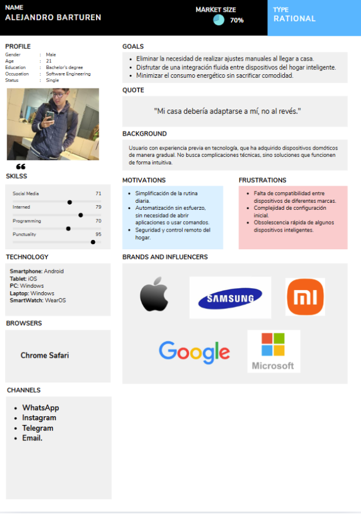

##### Segmento 2: Negocios que buscan experiencias de bienvenida automatizadas

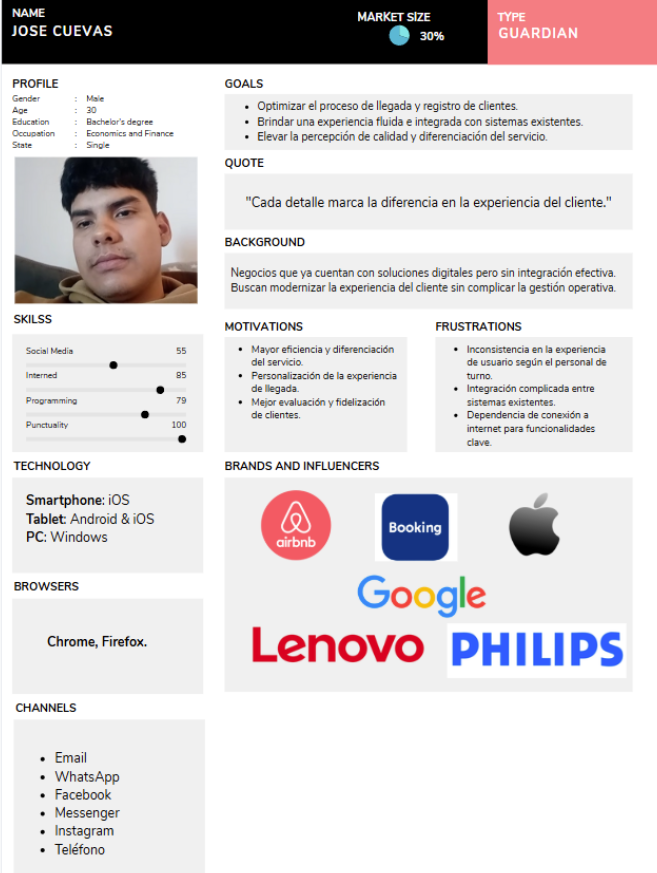

#### 2.3.2 User Task Matrix

En esta sección se presenta la User Task Matrix, en la cual se analizan las actividades realizadas por los segmentos identificados: usuarios residenciales con hogares inteligentes y negocios interesados en implementar experiencias de bienvenida automatizadas. El objetivo de esta matriz es comprender cómo dichas actividades se relacionan con el uso potencial de una solución como GeoEntry, la cual integra tecnologías IoT e Inteligencia Artificial para automatizar procesos en función de la presencia y los patrones de comportamiento del usuario.
 
A través de esta herramienta, se identifican las tareas clave, así como su frecuencia e importancia para cada User Persona, lo que permite reconocer oportunidades donde GeoEntry puede optimizar la experiencia mediante automatización inteligente, integración de dispositivos y personalización de entornos. 

Matriz de tareas
| Tarea | Alejandro (Frecuencia) | Alejandro (Importancia) | José (Frecuencia) | José (Importancia) |
| ------ | ------ | ------ | ------ | ------ |  
| Configurar automatizaciones para llegada en función de la proximidad del usuario | A menudo | Alta | A menudo | Alta |
| Ajustar dispositivos inteligentes para optimizar confort y eficiencia energética de forma automatizada | A menudo | Alta | A veces | Media |
| Integrar dispositivos IoT de diferentes marcas en un sistema unificado | A veces | Alta | A menudo | Alta |
| Supervisar la seguridad mediante sistemas inteligentes conectados | A menudo | Alta | A veces | Media |
|Evaluar la compatibilidad de nuevos dispositivos con el ecosistema automatizado | A veces | Media | A menudo | Alta |
|Configurar preferencias personalizadas en experiencias automatizadas (usuarios o clientes)|Nunca|Baja|A menudo|Alta|
|Optimizar procesos de ingreso mediante automatización y detección de presencia|Nunca|Baja|A menudo|Alta|
|Implementar soluciones de detección automática de presencia basadas en ubicación|A veces|Alta|A menudo|Alta|
|Evaluar costos asociados a la implementación de soluciones de automatización inteligente|A menudo|Alta|A menudo|Alta|
|Seleccionar plataformas digitales para la gestión centralizada de dispositivos IoT|A veces|Media|A menudo|Alta|
|Analizar aspectos de privacidad y seguridad de datos en sistemas inteligentes|A veces|Alta|A menudo|Alta|
|Personalizar configuraciones automáticas según hábitos y patrones de uso detectados|A menudo|Alta|A veces|Media|
 

##### Análisis de Tareas

A partir del análisis de la matriz de tareas, se identifica que tanto los usuarios residenciales con hogares inteligentes como los negocios interesados en experiencias de bienvenida automatizadas coinciden en la relevancia de actividades vinculadas a la automatización, la integración tecnológica y la personalización basada en el comportamiento del usuario. Estas coincidencias evidencian un contexto favorable para la implementación de una solución como GeoEntry, la cual integra IoT e Inteligencia Artificial para optimizar dichos procesos de manera autónoma.

##### Tareas de alta frecuencia e importancia para usuarios residenciales

- Configurar automatizaciones para la llegada en función de la proximidad:
    Constituye una necesidad prioritaria, ya que los usuarios buscan eliminar la intervención manual en acciones como el acceso, iluminación y climatización, favoreciendo una experiencia automatizada desde el ingreso al hogar.
- Supervisar la seguridad mediante dispositivos inteligentes conectados:
    La posibilidad de monitoreo remoto y control en tiempo real representa un factor clave, especialmente cuando se integra con sistemas automatizados de acceso.
- Personalizar configuraciones según hábitos y rutinas:
    Los usuarios valoran sistemas capaces de adaptarse dinámicamente a sus patrones de comportamiento, lo cual se alinea directamente con el uso de Inteligencia Artificial para aprendizaje y predicción.
- Evaluar costos de inversión en soluciones de automatización:
    Existe una alta preocupación por la relación costo-beneficio, priorizando soluciones escalables, eficientes y de fácil implementación.

##### Tareas de alta frecuencia e importancia para negocios

- Optimizar el proceso de llegada y registro de clientes mediante automatización:
    La automatización del ingreso y la reducción de fricciones impactan directamente en la percepción del servicio y la eficiencia operativa.
- Configurar preferencias personalizadas en experiencias automatizadas:
    Los negocios buscan ofrecer entornos adaptados a perfiles de clientes, lo que implica sistemas capaces de reconocer patrones y ajustar condiciones automáticamente.
- Implementar soluciones de detección automática de presencia:
    La identificación del usuario en tiempo real permite activar procesos automatizados, mejorando la fluidez en la gestión de espacios y servicios.
- Evaluar la compatibilidad e integración con sistemas existentes:
    La necesidad de interoperabilidad entre dispositivos y plataformas es crítica para evitar la fragmentación tecnológica y asegurar un funcionamiento eficiente.

 

La coincidencia entre ambos segmentos radica en la necesidad de una automatización inteligente y sin fricciones, donde la tecnología se adapta al usuario mediante el reconocimiento de presencia y el aprendizaje de hábitos, en lugar de requerir interacción constante. En este contexto, aspectos como la integración de dispositivos IoT, la seguridad de la información y la personalización de la experiencia se consolidan como factores determinantes. 
Estos hallazgos validan la propuesta de valor de GeoEntry, al evidenciar la demanda de soluciones que combinen automatización basada en proximidad con capacidades de Inteligencia Artificial, permitiendo una gestión eficiente, predictiva y adaptativa tanto en entornos residenciales como comerciales.

#### 2.3.3 Empathy Mapping

##### Segmento 1: Usuarios Residenciales de Hogares Inteligentes

| **¿Qué Piensa y Siente?** | **¿Qué ve?** |
|---|---|
|Busca un entorno doméstico que se adapte automáticamente a su presencia sin intervención manual.|Observa que muchas soluciones de domótica requieren múltiples aplicaciones y configuraciones complejas.|
|Se siente frustrado por la falta de interoperabilidad entre dispositivos de distintas marcas.|Identifica limitaciones en la integración de dispositivos dentro de un mismo ecosistema.|
|Tiene preocupaciones sobre privacidad de datos y obsolescencia tecnológica.|Percibe nuevas soluciones tecnológicas, pero duda de su valor diferencial real.|
|Prioriza la comodidad y la eficiencia energética como beneficios clave.|Encuentra opiniones de usuarios con problemas similares en foros y redes sociales.|

 

| **¿Qué Dice y Hace?** | **¿Qué oye?** |
|---|---|
|Expresa la necesidad de automatización intuitiva y sin configuraciones complejas.|Escucha opiniones mixtas sobre la efectividad de los sistemas inteligentes actuales.|
|Busca centralizar el control de dispositivos en una sola plataforma.|Oye sobre nuevas tecnologías, pero percibe barreras en instalación y configuración.|
|Desea eliminar acciones manuales como uso de llaves o activación de dispositivos.|Recibe información sobre soluciones automatizadas con valoraciones inconsistentes.|
|Explora alternativas de automatización basadas en presencia.|Escucha experiencias negativas relacionadas con integración y usabilidad.|

 

| **Dolores** | **Ganancias** |
|---|---|
|Fragmentación de aplicaciones y falta de integración entre dispositivos IoT.|Contar con un sistema unificado que integre dispositivos de manera transparente.|
|Dificultad para adaptar automatizaciones a rutinas variables.|Disponer de automatización basada en proximidad y hábitos sin intervención manual.|
|Preocupaciones sobre privacidad, seguridad y obsolescencia.|Acceder a una solución escalable compatible con su ecosistema actual.|

 

##### Segmento 2: Negocios con Experiencia de Bienvenida Automatizada

| **¿Qué Piensa y Siente?** | **¿Qué ve?** |
|---|---|
|Busca mejorar la experiencia de llegada mediante automatización y personalización.|Observa que la competencia adopta tecnologías para optimizar la experiencia del cliente.|
|Prioriza la seguridad y el monitoreo en la adopción tecnológica.|Identifica limitaciones en la integración de soluciones con sistemas existentes.|
|Se preocupa por la continuidad operativa ante fallas técnicas.|Percibe que muchas soluciones requieren inversiones elevadas para funcionar correctamente.|
|Necesita integración con sistemas de gestión y reservas.|Detecta que las soluciones no siempre se adaptan a necesidades específicas del negocio.|

 

| **¿Qué Dice y Hace?** | **¿Qué oye?** |
|---|---|
|Destaca la importancia de una experiencia de ingreso fluida y sin fricciones.|Escucha quejas de clientes sobre tiempos de espera y procesos ineficientes.|
|Investiga tecnologías de reconocimiento automático de clientes.|Oye sobre sistemas automatizados con limitaciones de integración.|
|Evalúa soluciones que integren automatización con gestión del negocio.|Recibe recomendaciones que no siempre cumplen estándares de seguridad.|
|Expresa preocupación por la seguridad de la información.|Escucha sobre riesgos asociados a sistemas poco confiables.|

 

| **Dolores** | **Ganancias** |
|---|---|
|Falta de integración entre sistemas de gestión y automatización.|Automatizar el reconocimiento de clientes y sus preferencias.|
|Inconsistencia en la experiencia del cliente por dependencia del personal.|Ofrecer una experiencia homogénea, eficiente y personalizada.|
|Riesgos en seguridad informática y protección de datos.|Contar con una solución robusta, integrada y confiable.|

#### 2.3.4 As-is Scenario Mapping

##### Segmento 1: Usuarios Residenciales de Hogares Inteligentes

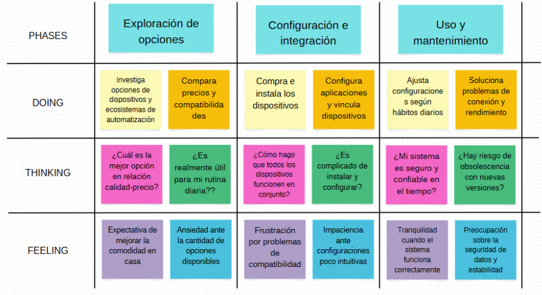

##### Segmento 2: Negocios con Experiencia de Bienvenida Automatizada

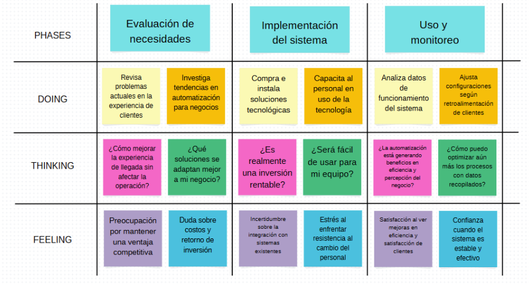

### 2.4 Ubiquitous Language

**Ubiquitous Language – GeoEntry**

| **Término** | **Definición** |
|---|---|
|GeoEntry|Sistema inteligente de automatización que integra tecnologías IoT e Inteligencia Artificial para gestionar accesos y ambientes de manera automática, basándose en la proximidad del usuario y el aprendizaje de sus hábitos.|
|Hogar Inteligente|Entorno residencial equipado con dispositivos IoT interconectados que permiten automatizar funciones como iluminación, seguridad y climatización, optimizados mediante detección de presencia y comportamiento del usuario.|
|Automatización Inteligente|Proceso mediante el cual un sistema ejecuta acciones sin intervención humana, utilizando datos de proximidad, sensores y modelos de aprendizaje para anticipar necesidades del usuario.|
|IoT (Internet of Things)|Red de dispositivos físicos (sensores, actuadores, ESP32, cerraduras inteligentes, etc.) conectados entre sí y a internet, que permiten la recolección y ejecución de datos en tiempo real dentro del sistema GeoEntry.|
|Inteligencia Artificial (IA)|Componente del sistema encargado de analizar patrones de comportamiento, horarios y preferencias del usuario para generar automatizaciones predictivas y personalizadas.|
|Detección de Proximidad|Capacidad del sistema para identificar la ubicación o cercanía del usuario mediante sensores o dispositivos móviles, activando automáticamente funciones como apertura de puertas o encendido de dispositivos.|
|Ecosistema IoT|Conjunto de dispositivos inteligentes interconectados que operan de forma integrada dentro de GeoEntry para ofrecer una experiencia automatizada y centralizada.|
|Integración de Dispositivos|Capacidad del sistema para conectar y coordinar dispositivos de diferentes marcas y tecnologías en una única plataforma funcional, evitando la fragmentación.|
|Control de Acceso Inteligente|Mecanismo automatizado que permite gestionar el ingreso de usuarios mediante reconocimiento de proximidad, credenciales digitales o patrones de comportamiento, sin necesidad de intervención manual.|
|Experiencia Automatizada|Interacción del usuario con el entorno en la que los sistemas responden de forma autónoma a su presencia y hábitos, generando comodidad, eficiencia y personalización.|
|Personalización Predictiva|Capacidad del sistema para anticipar necesidades del usuario basándose en datos históricos, ajustando automáticamente variables como iluminación, temperatura o acceso.|
|Seguridad Inteligente|Conjunto de mecanismos que protegen tanto el acceso físico como los datos del sistema, incluyendo autenticación, cifrado y monitoreo en tiempo real dentro del ecosistema GeoEntry.|
|Interfaz de Gestión|Plataforma digital (app o dashboard) que permite al usuario visualizar, configurar y supervisar el comportamiento del sistema, incluyendo automatizaciones y datos recolectados.|
|Eficiencia Energética|Optimización del consumo de recursos mediante la activación inteligente de dispositivos solo cuando es necesario, basada en la presencia y hábitos del usuario.|
|Escalabilidad del Sistema|Capacidad de GeoEntry para expandirse mediante la incorporación de nuevos dispositivos, funcionalidades o espacios, manteniendo un rendimiento óptimo.|
|Interoperabilidad|Habilidad del sistema para funcionar de manera fluida con múltiples dispositivos, protocolos y plataformas externas, garantizando una experiencia integrada.|

## Capítulo III: Requirements Specification

### 3.1.	To-Be Scenario Mapping.

Para realizar el To-be Scenario Mapping el equipo determinó como se vería el flujo de trabajo luego de que nuestra solución, GeoEntry, haya sido implementada para los segmentos objetivos.

**Jovenes**

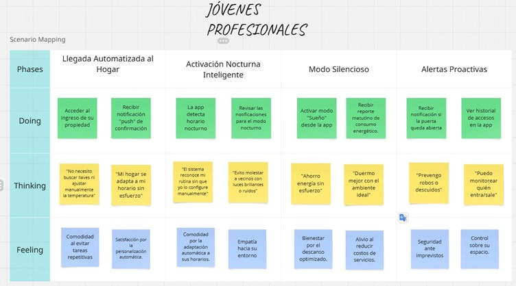

**Familias**

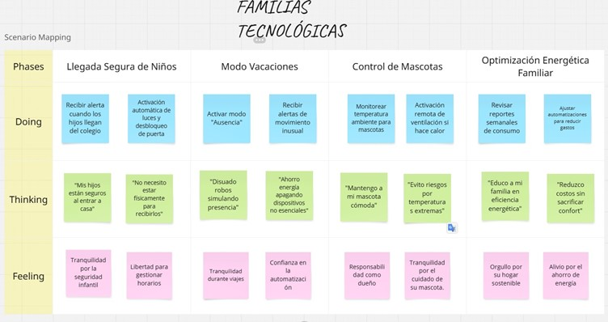

### 3.2.	User Stories.

#### Épicas

<table>
  <thead>
    <tr>
      <th>Epic / User Story ID</th>
      <th>Título</th>
      <th>Descripción</th>
    </tr>
  </thead>
  <tbody>
    <tr>
      <td>EP01</td>
      <td>Autonomía del Hogar Inteligente</td>
      <td>Como usuario, quiero que mi hogar detecte mi presencia y ejecute acciones automáticamente (desbloquear cerradura, encender luces, ajustar clima), para vivir una experiencia completamente manos libres.</td>
    </tr>
    <tr>
      <td>EP02</td>
      <td>Gestión de Dispositivos</td>
      <td>Como usuario, quiero agregar, configurar, monitorear y controlar mis dispositivos inteligentes (luces, termostatos, cerraduras, sensores ESP32) desde una única interfaz, para gestionar mi hogar de manera centralizada y en tiempo real.</td>
    </tr>
    <tr>
      <td>EP03</td>
      <td>Inteligencia y Aprendizaje Adaptativo</td>
      <td>Como usuario, quiero que el sistema aprenda mis patrones de comportamiento y se anticipe a mis necesidades sin intervención manual, para optimizar el confort y la eficiencia energética de mi hogar.</td>
    </tr>
    <tr>
      <td>EP04</td>
      <td>Seguridad y Control de Acceso</td>
      <td>Como administrador del hogar, quiero gestionar quién accede a mi hogar y a qué dispositivos, con alertas automáticas ante accesos no autorizados, para mantener la seguridad de mi familia y mis espacios.</td>
    </tr>
    <tr>
      <td>EP05</td>
      <td>Monitoreo, Reportes y Analíticas</td>
      <td>Como usuario, quiero acceder a registros de actividad, reportes de consumo energético y analíticas de patrones de uso, para tomar decisiones informadas sobre el uso de mis dispositivos.</td>
    </tr>
    <tr>
      <td>EP06</td>
      <td>Configuración y Soporte</td>
      <td>Como usuario, quiero acceder a opciones de configuración global (idioma, notificaciones, geocercas) y canales de soporte técnico, para personalizar la experiencia y resolver problemas rápidamente.</td>
    </tr>
  </tbody>
</table>

#### User Stories

<table>
  <thead>
    <tr>
      <th>Epic / User Story ID</th>
      <th>Título</th>
      <th>Descripción</th>
      <th>Criterios de Aceptación</th>
      <th>Relacionado con (Epic ID)</th>
    </tr>
  </thead>
  <tbody>
    <tr>
      <td>US01</td>
      <td>Automatización por proximidad</td>
      <td>Como usuario residencial, quiero que mi hogar detecte mi llegada para que se desbloquee la cerradura y se preparen los dispositivos automáticamente, para tener mi hogar listo sin ninguna acción manual.</td>
      <td>
        <strong>E1:</strong> Si entra al radio (100m), emite <code>user.entered</code>, abre cerradura y activa dispositivos en &lt; 2s. 
        <strong>E2:</strong> Si el ESP32 no responde, notifica error de conexión. 
        <strong>E3:</strong> Si se aleja > 200m por 5 min, activa modo Ausencia y bloquea cerradura.
      </td>
      <td>EP01</td>
    </tr>
    <tr>
      <td>US02</td>
      <td>Control manual en tiempo real</td>
      <td>Como usuario, quiero activar o desactivar dispositivos manualmente desde la app móvil, para tener control total cuando lo desee.</td>
      <td>
        <strong>E1:</strong> Respuesta del dispositivo en &lt; 500ms tras comando. 
        <strong>E2:</strong> Si no hay red, muestra "Dispositivo sin conexión". 
        <strong>E3:</strong> Lista visual con nombre, ubicación y estado On/Off real.
      </td>
      <td>EP02</td>
    </tr>
    <tr>
      <td>US03</td>
      <td>Aprendizaje de hábitos</td>
      <td>Como usuario, quiero que el sistema aprenda mis horarios de uso de luces y AC, para que se anticipe a mis necesidades sin reglas manuales.</td>
      <td>
        <strong>E1:</strong> Tras 7 días de rutina, el proceso batch nocturno genera sugerencias de automatización. 
        <strong>E2:</strong> Con &lt; 3 días de uso, informa que requiere más datos. 
        <strong>E3:</strong> Ejecución automática si la confianza del modelo es alta, notificando al usuario.
      </td>
      <td>EP03</td>
    </tr>
    <tr>
      <td>US04</td>
      <td>Recibir alerta al llegar</td>
      <td>Como usuario, quiero que la app me notifique al acercarme a mi ubicación configurada, para tener un registro de detección.</td>
      <td>
        <strong>E1:</strong> Notificación push "¡Bienvenido a Casa!" a los 30m. 
        <strong>E2:</strong> Si la precisión GPS es > 300m, notifica baja señal.
      </td>
      <td>EP04</td>
    </tr>
    <tr>
      <td>US05</td>
      <td>Recibir alerta al salir</td>
      <td>Como usuario, quiero ser notificado cuando salga de mi zona configurada, para confirmar la activación del modo Ausencia.</td>
      <td>
        <strong>E1:</strong> Notificación de salida al alejarse > 20m. 
        <strong>E2:</strong> Espera de 2 min ante fluctuaciones en el límite de zona antes de confirmar.
      </td>
      <td>EP04</td>
    </tr>
    <tr>
      <td>US06</td>
      <td>Agregar dispositivo</td>
      <td>Como usuario, quiero agregar un dispositivo desde la app para comenzar a controlar mi hogar inteligente.</td>
      <td>
        <strong>E1:</strong> Registro exitoso y visualización inmediata en la lista. 
        <strong>E2:</strong> Si ya está vinculado a otra cuenta, bloquea y sugiere soporte.
      </td>
      <td>EP02</td>
    </tr>
    <tr>
      <td>US07</td>
      <td>Desconectar dispositivo</td>
      <td>Como usuario, quiero remover dispositivos que ya no uso para mantener mi lista organizada.</td>
      <td>
        <strong>E1:</strong> Eliminación y remoción inmediata del dashboard. 
        <strong>E2:</strong> Bloquea eliminación si el dispositivo está en una rutina activa.
      </td>
      <td>EP02</td>
    </tr>
    <tr>
      <td>US08</td>
      <td>Invitar a un familiar</td>
      <td>Como administrador, quiero compartir acceso con un familiar con permisos específicos para un control seguro.</td>
      <td>
        <strong>E1:</strong> Envío de enlace de activación por email tras asignar permisos. 
        <strong>E2:</strong> Bloqueo de invitación si se alcanza el límite del plan.
      </td>
      <td>EP04</td>
    </tr>
    <tr>
      <td>US09</td>
      <td>Revocar acceso</td>
      <td>Como administrador, quiero retirar permisos a usuarios invitados para mantener la seguridad.</td>
      <td>
        <strong>E1:</strong> Pérdida de acceso inmediata tras confirmar revocación. 
        <strong>E2:</strong> El administrador principal no puede revocarse a sí mismo.
      </td>
      <td>EP04</td>
    </tr>
    <tr>
      <td>US10</td>
      <td>Ver historial de actividad</td>
      <td>Como usuario, quiero revisar las actividades recientes de mis dispositivos para monitorear el sistema.</td>
      <td>
        <strong>E1:</strong> Lista con fecha, hora y acción del evento seleccionado. 
        <strong>E2:</strong> Filtros funcionales por tipo (ej: Alertas). 
        <strong>E3:</strong> Mensaje informativo si no hay registros en el periodo.
      </td>
      <td>EP05</td>
    </tr>
    <tr>
      <td>US11</td>
      <td>Visualizar analíticas</td>
      <td>Como usuario, quiero visualizar analíticas de patrones de ubicación y actividad para ver insights de comportamiento.</td>
      <td>
        <strong>E1:</strong> Gráficos de horas pico y uso por dispositivo disponibles. 
        <strong>E2:</strong> Notificación de "Datos insuficientes" si el uso es &lt; 3 días.
      </td>
      <td>EP05</td>
    </tr>
    <tr>
      <td>US12</td>
      <td>Visualizar ubicaciones</td>
      <td>Como usuario, quiero ver mis ubicaciones en lista y mapa para asegurar que los radios son correctos.</td>
      <td>
        <strong>E1:</strong> Lista detallada con nombre y radio (ej: 100m). 
        <strong>E2:</strong> Marcadores personalizados visibles en mapa. 
        <strong>E3:</strong> Edición de geocerca entre 50m y 500m con reflejo inmediato.
      </td>
      <td>EP06</td>
    </tr>
    <tr>
      <td>US13</td>
      <td>Resumen general (Dashboard)</td>
      <td>Como usuario, quiero un resumen consolidado de ubicaciones, dispositivos y eventos para una visión rápida.</td>
      <td>
        <strong>E1:</strong> Carga de dashboard con estados activos y eventos recientes. 
        <strong>E2:</strong> Botón de reintento ante errores de carga del servidor.
      </td>
      <td>EP05</td>
    </tr>
    <tr>
      <td>US14</td>
      <td>Cambiar idioma</td>
      <td>Como usuario, quiero seleccionar el idioma de la interfaz (ES/EN) para mayor comodidad.</td>
      <td>
        <strong>E1:</strong> Traducción inmediata de la interfaz tras selección. 
        <strong>E2:</strong> Reversión al idioma anterior si el seleccionado no es soportado.
      </td>
      <td>EP06</td>
    </tr>
    <tr>
      <td>US15</td>
      <td>Contactar soporte</td>
      <td>Como usuario, quiero enviar tickets de soporte desde la app para resolver problemas técnicos.</td>
      <td>
        <strong>E1:</strong> Confirmación visual y recepción de email con número de ticket. 
        <strong>E2:</strong> Validación de campos obligatorios y formato de email.
      </td>
      <td>EP06</td>
    </tr>
    <tr>
      <td>US16</td>
      <td>Editar perfil</td>
      <td>Como usuario, quiero editar mi nombre y foto de avatar para personalizar mi cuenta.</td>
      <td>
        <strong>E1:</strong> Actualización global de imagen (JPG/PNG). 
        <strong>E2:</strong> Restricción de tamaño de archivo a un máximo de 2MB.
      </td>
      <td>EP06</td>
    </tr>
    <tr>
      <td>US17</td>
      <td>Redirección desde Landing</td>
      <td>Como visitante, quiero que el botón "Solicitar Demo" me lleve al login para probar la app.</td>
      <td>
        <strong>E1:</strong> Redirección exitosa a la página de inicio de sesión. 
        <strong>E2:</strong> El botón "Saber más" dirige a la sección de Características.
      </td>
      <td>EP06</td>
    </tr>
    <tr>
      <td>US18</td>
      <td>Registro de nuevo usuario</td>
      <td>Como usuario interesado, quiero crear una cuenta en GeoEntry proporcionando mis datos básicos, para empezar a configurar mi hogar inteligente.</td>
      <td>
        <strong>E1:</strong> Registro exitoso mediante email y contraseña con validación de formato. 
        <strong>E2:</strong> El sistema impide el registro si el email ya existe en la base de datos. 
        <strong>E3:</strong> Envío automático de correo de bienvenida tras la creación de la cuenta.
      </td>
      <td>EP06</td>
    </tr>
    <tr>
      <td>US19</td>
      <td>Inicio de sesión (Login)</td>
      <td>Como usuario registrado, quiero ingresar a mi cuenta de forma segura, para gestionar mis dispositivos y ubicaciones.</td>
      <td>
        <strong>E1:</strong> Autenticación exitosa que genera un token JWT para persistencia de sesión. 
        <strong>E2:</strong> Notificación de "Credenciales incorrectas" ante datos inválidos. 
        <strong>E3:</strong> Opción de "Mantener sesión iniciada" para evitar logueos constantes.
      </td>
      <td>EP06</td>
    </tr>
    <tr>
      <td>US20</td>
      <td>Recuperación de contraseña</td>
      <td>Como usuario, quiero restablecer mi contraseña en caso de olvidarla, para no perder el acceso a mi cuenta.</td>
      <td>
        <strong>E1:</strong> Envío de enlace temporal de recuperación al email registrado. 
        <strong>E2:</strong> El enlace expira tras 1 hora por motivos de seguridad. 
        <strong>E3:</strong> Confirmación visual tras el cambio exitoso de la clave.
      </td>
      <td>EP06</td>
    </tr>
    <tr>
      <td>US21</td>
      <td>Cierre de sesión (Logout)</td>
      <td>Como usuario, quiero cerrar mi sesión de forma segura, para proteger mi información en dispositivos compartidos.</td>
      <td>
        <strong>E1:</strong> Invalidación inmediata del token de acceso al confirmar la salida. 
        <strong>E2:</strong> Redirección automática a la pantalla de login tras cerrar sesión.
      </td>
      <td>EP06</td>
    </tr>
    <tr>
      <td>US22</td>
      <td>Configuración de geocerca inicial</td>
      <td>Como usuario, quiero definir el radio de mi hogar en el mapa para que el sistema sepa exactamente cuándo activar la automatización.</td>
      <td>
        <strong>E1:</strong> El usuario puede marcar un punto central en el mapa. 
        <strong>E2:</strong> El sistema permite definir un radio (ej: 100m) y guardarlo como "Hogar".
      </td>
      <td>EP06</td>
    </tr>
  </tbody>
</table>

#### Technical Stories

<table>
  <thead>
    <tr>
      <th>Epic / User Story ID</th>
      <th>Título</th>
      <th>Descripción</th>
      <th>Criterios de Aceptación</th>
      <th>Relacionado con (Epic ID)</th>
    </tr>
  </thead>
  <tbody>
    <tr>
      <td>TS01</td>
      <td>POST /api/devices</td>
      <td>Como desarrollador, quiero implementar el endpoint para registrar nuevos dispositivos, para permitir que el sistema almacene y gestione dispositivos ESP32 y otros dispositivos inteligentes.</td>
      <td>
        <strong>E1:</strong> Recibe JSON válido, responde 201 Created y el ID del dispositivo. 
        <strong>E2:</strong> Si falta el campo 'type', responde 400 Bad Request y mensaje de error.
      </td>
      <td>EP02</td>
    </tr>
    <tr>
      <td>TS02</td>
      <td>GET /api/devices/{device_id}</td>
      <td>Como desarrollador, quiero implementar el endpoint para obtener los detalles de un dispositivo específico, para que la app pueda mostrar el estado actualizado en tiempo real.</td>
      <td>
        <strong>E1:</strong> Con ID válido, responde 200 OK y datos completos del dispositivo. 
        <strong>E2:</strong> Si el ID no existe, responde 404 Not Found.
      </td>
      <td>EP02</td>
    </tr>
    <tr>
      <td>TS03</td>
      <td>PUT /api/routines/{routine_id}</td>
      <td>Como desarrollador, quiero implementar el endpoint para actualizar una rutina de automatización existente, para que el AI Service pueda modificar reglas basadas en patrones aprendidos.</td>
      <td>
        <strong>E1:</strong> Actualización exitosa con JSON válido responde 200 OK. 
        <strong>E2:</strong> Si la rutina no existe, responde 404 Not Found.
      </td>
      <td>EP03</td>
    </tr>
    <tr>
      <td>TS04</td>
      <td>DELETE /api/access-codes/{code}</td>
      <td>Como desarrollador, quiero implementar el endpoint para eliminar códigos de acceso temporales, para revocar accesos expirados o innecesarios.</td>
      <td>
        <strong>E1:</strong> Código válido es desactivado y responde 200 OK. 
        <strong>E2:</strong> Si el código es inválido o ya expiró, responde 404 Not Found.
      </td>
      <td>EP04</td>
    </tr>
    <tr>
      <td>TS05</td>
      <td>POST /api/notifications</td>
      <td>Como desarrollador, quiero implementar el endpoint para enviar notificaciones push, para que los servicios de proximidad, seguridad e IA puedan despachar alertas.</td>
      <td>
        <strong>E1:</strong> Envío correcto al canal del usuario responde 202 Accepted. 
        <strong>E2:</strong> Si el user_id no existe, responde 404 Not Found.
      </td>
      <td>EP04, EP06</td>
    </tr>
    <tr>
      <td>TS06</td>
      <td>POST /api/proximity/events</td>
      <td>Como desarrollador, quiero implementar el endpoint para recibir y publicar eventos de proximidad desde sensores ESP32, para emitir eventos user.entered/exited.</td>
      <td>
        <strong>E1:</strong> Procesa "arrived", publica user.entered y responde 200 OK en &lt; 2s. 
        <strong>E2:</strong> Procesa "departed", activa modo Ausencia y responde 200 OK. 
        <strong>E3:</strong> Payload sin campo 'event' responde 400 Bad Request.
      </td>
      <td>EP01</td>
    </tr>
    <tr>
      <td>TS07</td>
      <td>POST /api/ai/train</td>
      <td>Como desarrollador, quiero implementar el endpoint para iniciar el proceso batch nocturno de reentrenamiento, para actualizar los patrones de comportamiento de los usuarios.</td>
      <td>
        <strong>E1:</strong> Ejecución por scheduler responde 202 Accepted con el ID del job. 
        <strong>E2:</strong> Con &lt; 3 días de historial, omite el entrenamiento y registra el motivo en logs.
      </td>
      <td>EP03</td>
    </tr>
    <tr>
      <td>TS08</td>
      <td>GET /api/ai/suggestions/{user_id}</td>
      <td>Como desarrollador, quiero implementar el endpoint para obtener sugerencias de automatización generadas por la IA, para que el usuario pueda aprobarlas o rechazarlas.</td>
      <td>
        <strong>E1:</strong> Responde 200 OK con lista de sugerencias y niveles de confianza. 
        <strong>E2:</strong> Si no hay sugerencias generadas, responde 200 OK con lista vacía [].
      </td>
      <td>EP03</td>
    </tr>
  </tbody>
</table>

### 3.3.	Impact Mapping.

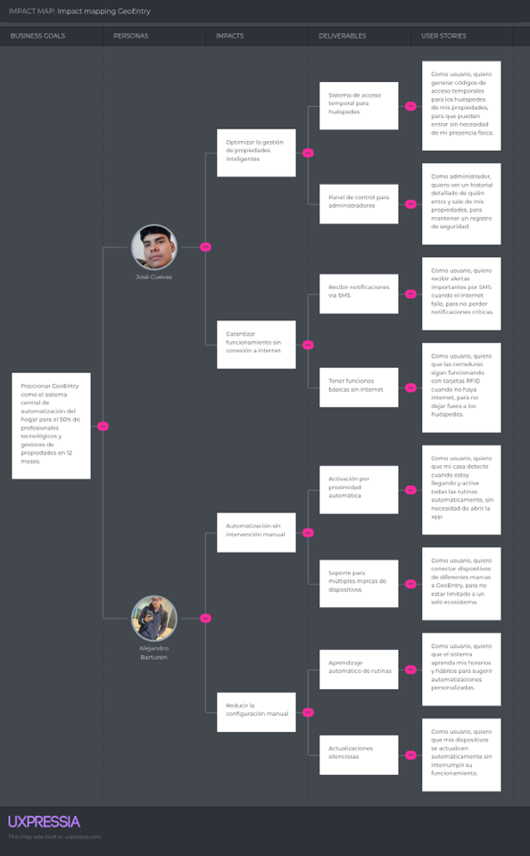

### 3.4.	Product Backlog.

<table>
  <thead>
    <tr>
      <th>Orden</th>
      <th>User Story Id</th>
      <th>Título</th>
      <th>Descripción</th>
      <th>Story Points</th>
    </tr>
  </thead>
  <tbody>
    <tr>
      <td>1</td>
      <td>US17</td>
      <td>Redirección desde Landing Page</td>
      <td>Como usuario visitante de GeoEntry, quiero hacer clic en el botón "Solicitar Demo" en la landing page para ser redirigido al login y acceder a la demo.</td>
      <td>1</td>
    </tr>
    <tr>
      <td>2</td>
      <td>US01</td>
      <td>Automatización por proximidad</td>
      <td>Como usuario residencial, quiero que mi hogar detecte mi llegada para que se desbloquee la cerradura y se preparen los dispositivos automáticamente.</td>
      <td>8</td>
    </tr>
    <tr>
      <td>3</td>
      <td>US22</td>
      <td>Configuración de geocerca inicial</td>
      <td>Como usuario, quiero definir el radio de mi hogar en el mapa para que el sistema sepa exactamente cuándo activar la automatización.</td>
      <td>3</td>
    </tr>
    <tr>
      <td>4</td>
      <td>US03</td>
      <td>Aprendizaje de hábitos</td>
      <td>Como usuario, quiero que el sistema aprenda mis horarios de uso de luces y AC para que se anticipe a mis necesidades.</td>
      <td>8</td>
    </tr>
    <tr>
      <td>5</td>
      <td>US02</td>
      <td>Control manual en tiempo real</td>
      <td>Como usuario, quiero activar o desactivar dispositivos manualmente desde la app móvil para tener control total cuando lo desee.</td>
      <td>5</td>
    </tr>
    <tr>
      <td>6</td>
      <td>US06</td>
      <td>Agregar dispositivo al sistema</td>
      <td>Como usuario nuevo de GeoEntry, quiero agregar un dispositivo desde la sección "Dispositivos" para comenzar a controlar mi hogar inteligente.</td>
      <td>5</td>
    </tr>
    <tr>
      <td>7</td>
      <td>US13</td>
      <td>Resumen general del sistema</td>
      <td>Como usuario, quiero visualizar un resumen consolidado de mis ubicaciones, dispositivos y eventos recientes para obtener una visión rápida del estado actual de mi cuenta.</td>
      <td>5</td>
    </tr>
    <tr>
      <td>8</td>
      <td>US04</td>
      <td>Recibir alerta al llegar a ubicación</td>
      <td>Como usuario, quiero que la aplicación me notifique al acercarme a mi ubicación configurada para tener un registro de mi actividad.</td>
      <td>5</td>
    </tr>
    <tr>
      <td>9</td>
      <td>US05</td>
      <td>Recibir alerta al salir de ubicación</td>
      <td>Como usuario, quiero ser notificado cuando salga de mi zona configurada para confirmar que el modo Ausencia se activó.</td>
      <td>5</td>
    </tr>
    <tr>
      <td>10</td>
      <td>US11</td>
      <td>Visualizar analíticas de patrones</td>
      <td>Como usuario, quiero visualizar analíticas sobre patrones de ubicación y actividad para obtener una visión clara del comportamiento registrado por el sistema.</td>
      <td>5</td>
    </tr>
    <tr>
      <td>11</td>
      <td>US12</td>
      <td>Visualizar ubicaciones configuradas</td>
      <td>Como usuario, quiero ver mis ubicaciones configuradas en lista y en mapa para consultarlas y asegurarme de que sus radios están correctamente registrados.</td>
      <td>5</td>
    </tr>
    <tr>
      <td>12</td>
      <td>US10</td>
      <td>Ver historial de actividad</td>
      <td>Como usuario, quiero revisar todas las actividades recientes de mis dispositivos para monitorear el funcionamiento del sistema.</td>
      <td>3</td>
    </tr>
    <tr>
      <td>13</td>
      <td>US08</td>
      <td>Invitar a un familiar</td>
      <td>Como administrador del hogar, quiero compartir acceso con un familiar y asignarle permisos específicos para que controle dispositivos determinados de manera segura.</td>
      <td>5</td>
    </tr>
    <tr>
      <td>14</td>
      <td>US09</td>
      <td>Revocar acceso a un usuario invitado</td>
      <td>Como administrador del hogar, quiero retirar permisos a usuarios invitados cuando ya no los necesiten para mantener la seguridad de mi hogar.</td>
      <td>3</td>
    </tr>
    <tr>
      <td>15</td>
      <td>US18</td>
      <td>Registro de nuevo usuario</td>
      <td>Como usuario interesado, quiero crear una cuenta en GeoEntry proporcionando mis datos básicos, para empezar a configurar mi hogar inteligente.</td>
      <td>5</td>
    </tr>
    <tr>
      <td>16</td>
      <td>US19</td>
      <td>Inicio de sesión (Login)</td>
      <td>Como usuario registrado, quiero ingresar a mi cuenta de forma segura, para gestionar mis dispositivos y ubicaciones.</td>
      <td>3</td>
    </tr>
    <tr>
      <td>17</td>
      <td>US20</td>
      <td>Recuperación de contraseña</td>
      <td>Como usuario, quiero restablecer mi contraseña en caso de olvidarla, para no perder el acceso a mi cuenta.</td>
      <td>3</td>
    </tr>
    <tr>
      <td>18</td>
      <td>US07</td>
      <td>Desconectar un dispositivo</td>
      <td>Como usuario, quiero remover dispositivos que ya no uso de mi sistema para mantener mi lista organizada.</td>
      <td>2</td>
    </tr>
    <tr>
      <td>19</td>
      <td>US16</td>
      <td>Editar perfil de usuario</td>
      <td>Como usuario, quiero editar mi información de perfil, incluyendo nombre y foto de avatar, para personalizar mi cuenta en GeoEntry.</td>
      <td>2</td>
    </tr>
    <tr>
      <td>20</td>
      <td>US14</td>
      <td>Cambiar idioma de la app</td>
      <td>Como usuario, quiero seleccionar el idioma de la interfaz (español/inglés) para mayor comodidad al usar la aplicación.</td>
      <td>2</td>
    </tr>
    <tr>
      <td>21</td>
      <td>US15</td>
      <td>Contactar al equipo de soporte</td>
      <td>Como usuario de GeoEntry, quiero enviar un mensaje o ticket al equipo de soporte desde la app para resolver problemas técnicos sin salir de la aplicación.</td>
      <td>2</td>
    </tr>
    <tr>
      <td>22</td>
      <td>US21</td>
      <td>Cierre de sesión (Logout)</td>
      <td>Como usuario, quiero cerrar mi sesión de forma segura, para proteger mi información en dispositivos compartidos.</td>
      <td>1</td>
    </tr>
  </tbody>
</table>

## Capítulo IV: Strategic-Level Software Design.

### 4.1.	Strategic-Level Attribute-Driven Design.

#### 4.1.1.	Design Purpose.

El propósito del diseño es establecer una arquitectura escalable y segura para una plataforma inteligente de automatización del hogar que elimine la intervención manual mediante el uso de geofencing e IA. Se busca satisfacer la necesidad de los usuarios residenciales de tener un hogar autónomo y de los negocios de gestionar múltiples sedes de forma centralizada. El diseño prioriza la privacidad de los datos mediante el procesamiento de patrones de comportamiento de forma local.

#### 4.1.2.	Attribute-Driven Design Inputs.

El proceso de diseño se nutre de requisitos funcionales críticos, atributos de calidad exigentes y restricciones técnicas innegociables.

##### 4.1.2.1.	Primary Functionality (Primary User Stories).

Se han seleccionado las historias de usuario que definen el comportamiento central del sistema y dictan la necesidad de microservicios especializados.

<table class="primary-functionality-section">
  <thead>
    <tr>
      <th>ID</th>
      <th>Título</th>
      <th>Descripción</th>
      <th>Criterios de Aceptación</th>
      <th>Relacionado con</th>
    </tr>
  </thead>
  <tbody>
    <tr>
      <td>US01</td>
      <td>Automatización por proximidad</td>
      <td>Como usuario residencial, quiero que mi hogar detecte mi llegada para que se desbloquee la cerradura y se preparen los dispositivos automáticamente.</td>
      <td>El sistema debe emitir eventos <code>user.entered</code> y ejecutar acciones en menos de 2 segundos.</td>
      <td>EPIC-01 (Autonomía)</td>
    </tr>
    <tr>
      <td>US02</td>
      <td>Control manual en tiempo real</td>
      <td>Como usuario, quiero activar o desactivar dispositivos manualmente desde la app móvil para tener control total cuando lo desee.</td>
      <td>La latencia entre el comando en la app y la respuesta del ESP32 no debe superar los 500ms.</td>
      <td>EPIC-02 (Gestión)</td>
    </tr>
    <tr>
      <td>US03</td>
      <td>Aprendizaje de hábitos</td>
      <td>Como usuario, quiero que el sistema aprenda mis horarios de uso de luces y AC para que se anticipe a mis necesidades.</td>
      <td>El AI Service debe actualizar los modelos de patrones cada noche en un proceso batch.</td>
      <td>EPIC-03 (Inteligencia)</td>
    </tr>
  </tbody>
</table>

##### 4.1.2.2.	Quality attribute Scenarios.

Estos escenarios definen la robustez y eficiencia que la arquitectura debe soportar.

<table class="quality-attribute-section">
  <thead>
    <tr>
      <th>Atributo</th>
      <th>Fuente</th>
      <th>Estímulo</th>
      <th>Artefacto</th>
      <th>Entorno</th>
      <th>Respuesta</th>
      <th>Medida</th>
    </tr>
  </thead>
  <tbody>
    <tr>
      <td>Privacidad</td>
      <td>Usuario</td>
      <td>Generación de patrones de comportamiento</td>
      <td>AI Service (Ollama)</td>
      <td>Operación normal</td>
      <td>Los datos se procesan localmente sin salir a nubes de terceros.</td>
      <td>100% de inferencias locales.</td>
    </tr>
    <tr>
      <td>Seguridad</td>
      <td>Sistema</td>
      <td>Salida del usuario del hogar</td>
      <td>Security Service</td>
      <td>Operación normal</td>
      <td>Bloqueo inmediato de la cerradura y deshabilitación de controles manuales.</td>
      <td>Bloqueo en &lt; 1 segundo.</td>
    </tr>
    <tr>
      <td>Disponibilidad</td>
      <td>Mobile App</td>
      <td>Reporte continuo de GPS</td>
      <td>Proximity Service</td>
      <td>Carga alta</td>
      <td>El servicio debe procesar cada evento de geofencing para disparar la automatización.</td>
      <td>99.9% de uptime del servicio.</td>
    </tr>
  </tbody>
</table>

##### 4.1.2.3.	Constraints.

Factores técnicos y de negocio que limitan las opciones de diseño.

<table class="constraints">
  <thead>
    <tr>
      <th>ID</th>
      <th>Título</th>
      <th>Descripción</th>
      <th>Criterios de Aceptación</th>
      <th>Relacionado con</th>
    </tr>
  </thead>
  <tbody>
    <tr>
      <td>CON-01</td>
      <td>Stack Tecnológico</td>
      <td>Uso de NestJS para lógica de negocio y Python para IA/Edge.</td>
      <td>Los servicios deben ser interoperables mediante gRPC o REST.</td>
      <td>Arquitectura Global</td>
    </tr>
    <tr>
      <td>CON-02</td>
      <td>Despliegue en Railway</td>
      <td>Todos los microservicios deben desplegarse en contenedores individuales en la plataforma Railway.</td>
      <td>Configuración de SSL automático por cada servicio.</td>
      <td>Infraestructura</td>
    </tr>
    <tr>
      <td>CON-03</td>
      <td>Hardware IoT</td>
      <td>Comunicación obligatoria con microcontroladores ESP32 vía HTTP/REST.</td>
      <td>Reporte de telemetría cada 5-10 segundos.</td>
      <td>Dispositivos</td>
    </tr>
  </tbody>
</table>

#### 4.1.3.	Architectural Drivers Backlog.

Priorización de los factores que más impactan en la complejidad técnica.

<table class="drivers">
  <thead>
    <tr>
      <th>ID</th>
      <th>Título de Driver</th>
      <th>Descripción</th>
      <th>Importancia Stakeholders</th>
      <th>Impacto en Arquitectura</th>
    </tr>
  </thead>
  <tbody>
    <tr>
      <td>D1</td>
      <td>Inferencia Local (Ollama)</td>
      <td>Procesamiento de IA sin costos de tokens y con privacidad total.</td>
      <td>High</td>
      <td>High</td>
    </tr>
    <tr>
      <td>D2</td>
      <td>SoC de Seguridad</td>
      <td>Aislamiento de la lógica de cerradura para evitar efectos colaterales.</td>
      <td>High</td>
      <td>Medium</td>
    </tr>
    <tr>
      <td>D3</td>
      <td>Comunicación Edge/IoT</td>
      <td>Gestión de telemetría y comandos en tiempo real con ESP32.</td>
      <td>Medium</td>
      <td>High</td>
    </tr>
  </tbody>
</table>

#### 4.1.4.	Architectural Design Decisions.

* **Adopción de Microservicios:** Se decidió separar responsabilidades en servicios NestJS para escalabilidad y mantenimiento independiente.
* **Motor de IA Local (Ollama):** Se descartaron APIs de nube para garantizar la privacidad y reducir costos operativos.
* **Estrategia de Persistencia:** Uso de Supabase para aprovechar PostgreSQL y capacidades de tiempo real para la Web App.

#### 4.1.5.	Quality Attribute Scenario Refinements.

Tras la finalización del Quality Attribute Workshop, el equipo de arquitectura determinó que la privacidad de los datos de comportamiento y la latencia en la respuesta física son los pilares críticos de la solución. Se decidió implementar Ollama en Docker para garantizar que el 100% de la inferencia de IA sea local y utilizar comunicación gRPC entre microservicios para minimizar los tiempos de respuesta en eventos de geofencing.

**Scenario Refinement for Scenario 1: Privacidad y Confidencialidad**

<table class="scenario-1-section">
  <thead>
    <tr>
      <th colspan="2">Scenario Refinement for Scenario 1</th>
    </tr>
  </thead>
  <tbody>
    <tr>
      <td><strong>Scenario(s):</strong></td>
      <td>Generación de patrones de hábitos del usuario sin exposición a nubes externas.</td>
    </tr>
    <tr>
      <td><strong>Business Goals:</strong></td>
      <td>Garantizar la privacidad total del hogar para generar confianza en el usuario residencial.</td>
    </tr>
    <tr>
      <td><strong>Relevant Quality Attributes:</strong></td>
      <td>Confidencialidad, Privacidad.</td>
    </tr>
    <tr>
      <td><strong>Scenario Components:</strong></td>
      <td>
        <ul>
          <li><strong>Stimulus Source:</strong> Hábitos diarios del usuario (iluminación, clima).</li>
          <li><strong>Stimulus:</strong> Análisis del historial para predicción de estados.</li>
          <li><strong>Environment:</strong> Operación normal del sistema (Modo Batch nocturno).</li>
          <li><strong>Artifact:</strong> AI Service operando con Ollama Engine.</li>
          <li><strong>Response:</strong> El procesamiento se realiza exclusivamente en el contenedor local de Railway.</li>
          <li><strong>Response Measure:</strong> 0% de datos personales o patrones de conducta son enviados a APIs externas.</li>
        </ul>
      </td>
    </tr>
    <tr>
      <td><strong>Questions:</strong></td>
      <td>¿El hardware de Railway soporta la carga del modelo LLM local?</td>
    </tr>
    <tr>
      <td><strong>Issues:</strong></td>
      <td>La latencia inicial de carga del modelo en el contenedor.</td>
    </tr>
  </tbody>
</table>

**Scenario Refinement for Scenario 2: Seguridad Física (Acceso)**

<table class="scenario-2-section">
  <thead>
    <tr>
      <th colspan="2">Scenario Refinement for Scenario 2</th>
    </tr>
  </thead>
  <tbody>
    <tr>
      <td><strong>Scenario(s):</strong></td>
      <td>Aseguramiento inmediato del hogar al detectar la salida del usuario.</td>
    </tr>
    <tr>
      <td><strong>Business Goals:</strong></td>
      <td>Ofrecer una solución de seguridad robusta y autónoma.</td>
    </tr>
    <tr>
      <td><strong>Relevant Quality Attributes:</strong></td>
      <td>Seguridad (Integridad), Fiabilidad.</td>
    </tr>
    <tr>
      <td><strong>Scenario Components:</strong></td>
      <td>
        <ul>
          <li><strong>Stimulus Source:</strong> Mobile App (GPS/Geofencing).</li>
          <li><strong>Stimulus:</strong> Evento users.left (usuario fuera del rango de casa).</li>
          <li><strong>Environment:</strong> Operación normal.</li>
          <li><strong>Artifact:</strong> Security Service (Lógica aislada).</li>
          <li><strong>Response:</strong> Bloqueo de cerradura física y restricción de controles manuales en apps.</li>
          <li><strong>Response Measure:</strong> El bloqueo debe completarse en menos de 1 segundo tras la recepción del evento.</li>
        </ul>
      </td>
    </tr>
    <tr>
      <td><strong>Questions:</strong></td>
      <td>¿Qué sucede si el ESP32 pierde conexión a internet al momento de la salida?</td>
    </tr>
    <tr>
      <td><strong>Issues:</strong></td>
      <td>Necesidad de un mecanismo de fallback local (Bluetooth) para emergencias.</td>
    </tr>
  </tbody>
</table>

**Scenario Refinement for Scenario 3: Disponibilidad y Rendimiento (Trigger)**

<table class="scenario-3-section">
  <thead>
    <tr>
      <th colspan="2">Scenario Refinement for Scenario 3</th>
    </tr>
  </thead>
  <tbody>
    <tr>
      <td><strong>Scenario(s):</strong></td>
      <td>Activación de dispositivos por proximidad con latencia imperceptible.</td>
    </tr>
    <tr>
      <td><strong>Business Goals:</strong></td>
      <td>Proporcionar una experiencia de usuario fluida y reactiva.</td>
    </tr>
    <tr>
      <td><strong>Relevant Quality Attributes:</strong></td>
      <td>Disponibilidad, Rendimiento.</td>
    </tr>
    <tr>
      <td><strong>Scenario Components:</strong></td>
      <td>
        <ul>
          <li><strong>Stimulus Source:</strong> Mobile App reportando GPS continuamente.</li>
          <li><strong>Stimulus:</strong> Detección de proximidad y reporte al REST API.</li>
          <li><strong>Environment:</strong> Carga alta de peticiones (múltiples usuarios).</li>
          <li><strong>Artifact:</strong> Proximity Service y Device Service.</li>
          <li><strong>Response:</strong> Inferencia del AI Service y envío de comandos al ESP32 vía gRPC.</li>
          <li><strong>Response Measure:</strong> Ejecución total de la automatización en &lt; 2 segundos desde el geofence.</li>
        </ul>
      </td>
    </tr>
    <tr>
      <td><strong>Questions:</strong></td>
      <td>¿Cómo afecta el modo de ahorro de energía del smartphone al geofencing?</td>
    </tr>
    <tr>
      <td><strong>Issues:</strong></td>
      <td>La precisión del GPS en interiores o zonas de baja cobertura.</td>
    </tr>
  </tbody>
</table>

Para este refinamiento, se ha integrado formalmente la lógica de inferencia para la toma de decisiones del **AI Service**:

$$P(Device_{on} | Context) = \sigma(W_{time} \cdot T + W_{history} \cdot H + W_{proximity} \cdot P)$$

**Leyenda:**

* **$P(Device_{on} | Context)$**: Es la Probabilidad de Encendido. Representa qué tan seguro está el sistema de que debe encender un dispositivo específico (como el AC o la cafetera) dado el contexto actual.
* **$\sigma$ (Sigma)**: Es la Función Sigmoide. Su trabajo es "aplastar" cualquier número que salga de la suma y convertirlo en un valor entre 0 y 1 (donde 1 es 100% de probabilidad).
* **$T$ (Time)**: El factor Tiempo. Representa la hora actual. No es lo mismo llegar a casa a las 2 PM (necesitas aire acondicionado) que a las 8 AM (necesitas la cafetera).
* **$H$ (History)**: El factor Historial. Son tus hábitos acumulados que el servicio analiza cada noche en el modo batch. Si el 90% de los lunes enciendes la TV al llegar, este valor será muy alto ese día.
* **$P$ (Proximity)**: El factor Proximidad. Indica qué tan cerca estás del hogar según el geofencing de la app. Ayuda a decidir si la acción debe ser inmediata o puede esperar un poco.
* **$W$ ($W_{time}, W_{history}, W_{proximity}$)**: Son los Pesos (Weights). Es lo que la IA realmente "aprende". Si el sistema nota que tus hábitos cambian según la hora pero no según tu ubicación, le dará más "peso" a $W_{time}$ que a $W_{proximity}$.

### 4.2.	Strategic-Level Domain-Driven Design.

#### 4.2.1.	EventStorming.

El **EventStorming** nos ayudó a visualizar el flujo completo de eventos, identificar los dominios clave y entender la lógica de negocio del sistema de manera colaborativa y visual.

[Anexo A:](https://miro.com/app/board/uXjVHcJsCQs=/?share_link_id=983372844497)

#### 4.2.2.	Candidate Context Discovery.

[Anexo B:](https://miro.com/app/board/uXjVHcJsCQs=/?moveToWidget=3458764625561166020&cot=14)

#### 4.2.3.	Domain Message Flows Modeling.

[Anexo C:](https://miro.com/app/board/uXjVHcJsCQs=/?moveToWidget=3458764625658175134&cot=14)

#### 4.2.4.	Bounded Context Canvases.

[Anexo D:](https://miro.com/app/board/uXjVHcJsCQs=/?moveToWidget=3458764625663746924&cot=14)

#### 4.2.5.	Context Mapping.

En esta sección se detalla el mapa de relaciones entre los seis Bounded Contexts que componen el ecosistema de GeoEntry. Tras el proceso de Candidate Context Discovery, el equipo evaluó la mejor forma de integrar estos dominios para garantizar que la automatización sea fluida pero, sobre todo, segura.

**Definición de Relaciones Estructurales**

Para definir el mapa, el equipo discutió alternativas clave como:

* **Aislamiento de Seguridad**: Se decidió que el Security Context sea el más restrictivo, actuando como un "Downstream" protegido de las decisiones probabilísticas del IA Context.
* **Centralización de Notificaciones**: En lugar de que cada servicio envíe alertas por su cuenta, se creó el Notification Context como un servicio especializado para desacoplar la lógica de mensajería del negocio central.

<table class="context-mapping-table">
  <thead>
    <tr>
      <th>Origen (Upstream)</th>
      <th>Destino (Downstream)</th>
      <th>Patrón de Relación</th>
      <th>Justificación Técnica</th>
    </tr>
  </thead>
  <tbody>
    <tr>
      <td>User Context</td>
      <td>Todos los Contextos</td>
      <td>Conformist</td>
      <td>El contexto de usuario provee la identidad y roles. Los demás servicios se "conforman" al formato del JWT para validar permisos.</td>
    </tr>
    <tr>
      <td>Proximity Context</td>
      <td>Security / Device</td>
      <td>Customer/Supplier</td>
      <td>Proximity detecta el geofencing (Proveedor) y Security/Device reaccionan (Clientes). Existe una alta coordinación para evitar falsos positivos.</td>
    </tr>
    <tr>
      <td>IA Context</td>
      <td>Device Context</td>
      <td>Upstream/Downstream (ACL)</td>
      <td>La IA entrega predicciones complejas. El Device Context usa una ACL (Anti-corruption Layer) para validar que la sugerencia sea un comando físico válido.</td>
    </tr>
    <tr>
      <td>Device Context</td>
      <td>Notification Context</td>
      <td>Customer/Supplier</td>
      <td>Cuando un dispositivo cambia de estado, el Notification Context "abastece" la alerta al usuario para confirmar la acción.</td>
    </tr>
    <tr>
      <td>Security Context</td>
      <td>Notification Context</td>
      <td>Customer/Supplier</td>
      <td>Eventos críticos (cerradura abierta) disparan alertas prioritarias de forma inmediata.</td>
    </tr>
  </tbody>
</table>

**Análisis de Decisiones de Diseño (Design Critique)**

* **Shared Kernel (Supabase)**: Se utiliza Supabase como núcleo compartido únicamente para la sincronización de estados en tiempo real. Esto permite que el cambio de una luz (Device Context) se refleje instantáneamente en la interfaz de usuario sin pasar por orquestaciones complejas.
* **Anti-corruption Layer (ACL) en IA**: Se implementó para proteger el hardware. Si el modelo local en Ollama generara una salida inesperada debido a una alucinación del modelo, la ACL en el Device Context filtra la petición, asegurando que solo comandos conocidos (ON/OFF, niveles de temperatura) lleguen al ESP32.
* **Independencia del Safety Context (Security)**: Al separar Security de Device, nos aseguramos de que si el servidor de luces falla, la cerradura siga funcionando de forma independiente y segura, siguiendo el principio de diseño de "falla segura".

### 4.3.	Software Architecture.

#### 4.3.1.	Software Architecture System Landscape Diagram.

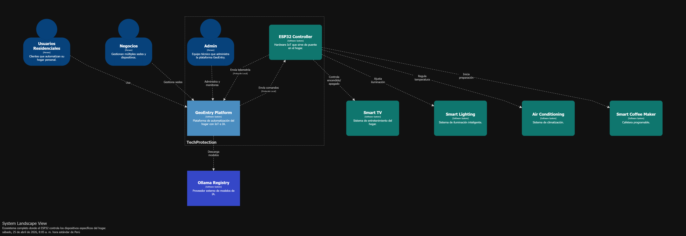

#### 4.3.2.	Software Architecture Context Level Diagrams.

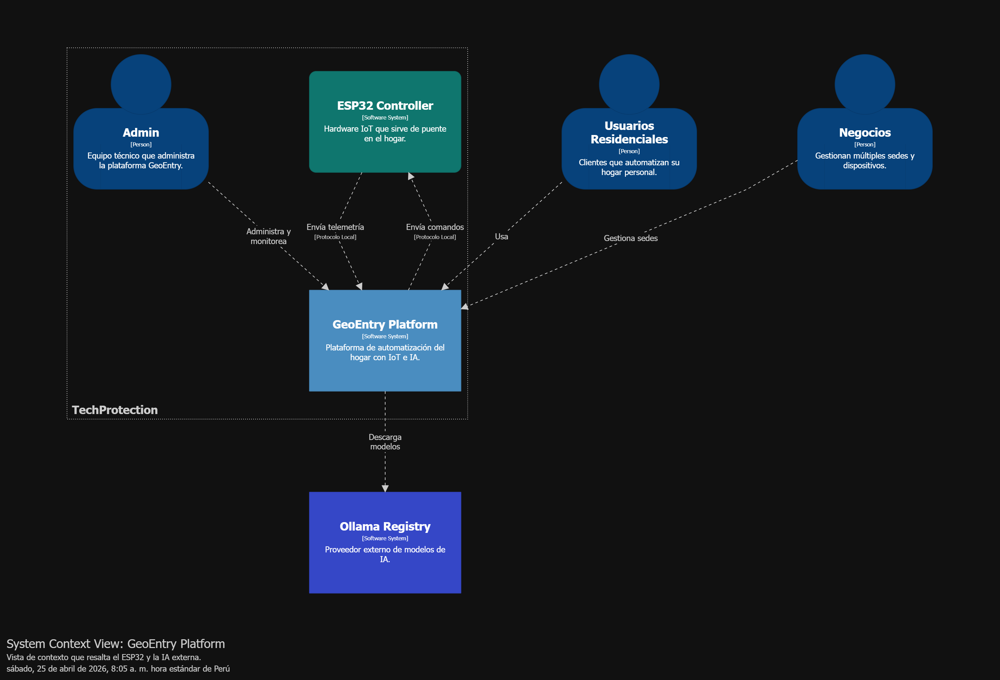

#### 4.3.3.	Software Architecture Container Level Diagrams.

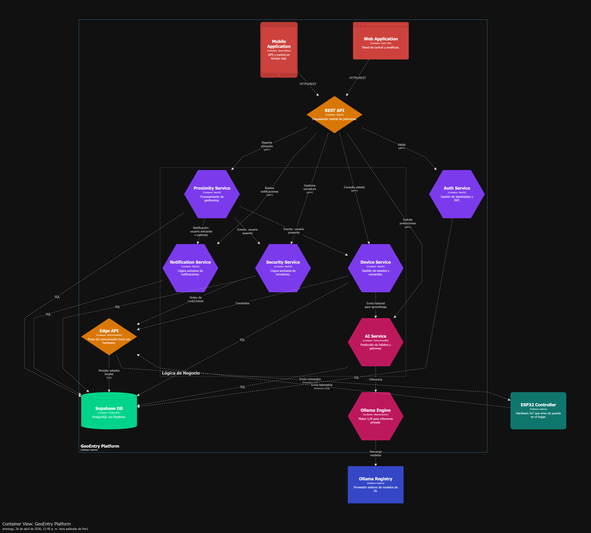

#### 4.3.3.	Software Architecture Deployment Diagrams.

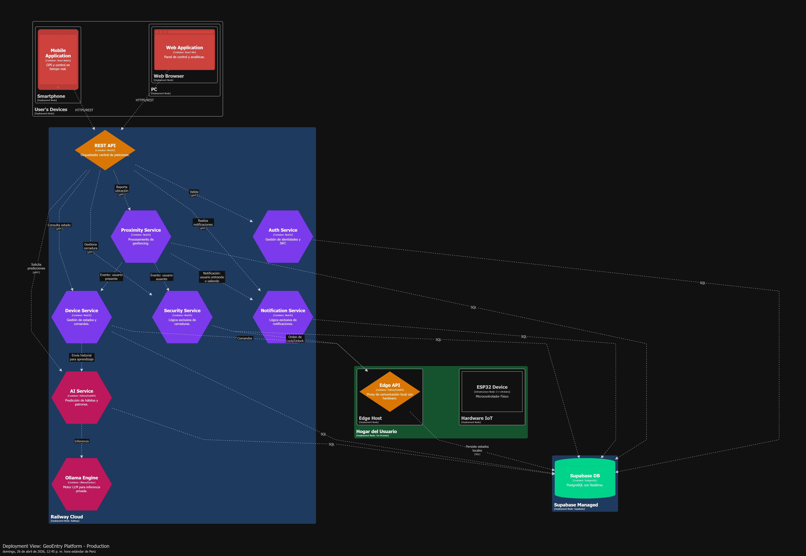

## Conclusiones

### Conclusiones y recomendaciones

El desarrollo de la solución **GeoEntry**, impulsado por la startup **TechProtection**, permitió validar de forma efectiva las hipótesis y suposiciones planteadas en el proceso **Lean UX**. A través de la investigación, se identificó que los usuarios, tanto residenciales como comerciales, enfrentan una fuerte fragmentación tecnológica y desean soluciones automatizadas que funcionen de manera fluida, sin requerir múltiples aplicaciones o intervención manual constante.

Las entrevistas y herramientas de análisis (como **User Personas**, **Empathy Mapping**, **User Task Matrix** y **As-is Scenario Mapping**) confirmaron que los usuarios valoran principalmente la comodidad, la eficiencia energética y la seguridad. En ese sentido, GeoEntry resolvió los *Problem Statements* al ofrecer una experiencia de llegada automatizada mediante geolocalización e IoT, eliminando fricciones comunes como la gestión manual de cerraduras, iluminación y climatización.

Los **Hypothesis Statements** fueron validados exitosamente en el ciclo de vida del proyecto:
*   **Interés en automatización por proximidad:** Se evidenció un interés real, con resultados que muestran que el 70% de los usuarios configurarían estas automatizaciones en sus primeros 30 días.
*   **Reducción de tareas manuales:** Se logró proyectar una reducción significativa, alcanzando un 60% de acciones ejecutadas de forma autónoma por el sistema.
*   **Adopción tecnológica:** La interfaz intuitiva fue bien aceptada, superando el 85% de éxito en la configuración inicial y manteniendo un bajo índice de abandono.

En base a los resultados obtenidos, el equipo recomienda:
1.  **Roadmap Iterativo:** Priorizar la integración con protocolos estándar como **Matter** y ecosistemas mayores (Alexa, Google Home, Apple HomeKit), además de mejorar la personalización de escenarios y la visualización de datos analíticos.
2.  **Validación Comercial:** Expandir el alcance hacia sectores B2B como **hotelería boutique, coworking y espacios de bienestar**, mediante pilotos que permitan adaptar la solución a sus necesidades operativas específicas.
3.  **Estrategias de Posicionamiento:** Fortalecer la presencia en el mercado mediante alianzas con inmobiliarias, arquitectos y showrooms, junto con campañas de marketing enfocadas en los beneficios de comodidad y ahorro energético.
4.  **Optimización Técnica:** Mejorar la eficiencia de los algoritmos de detección de presencia, optimizar el consumo energético de los dispositivos ESP32 y asegurar la robustez del sistema en modo offline.
5.  **Escalabilidad y Soporte:** Diseñar una infraestructura que soporte un crecimiento en el número de usuarios sin degradar el rendimiento, e implementar canales de soporte técnico accesibles para facilitar la adopción por usuarios principiantes.

GeoEntry se consolida como una propuesta de alto valor con potencial para convertirse en referente regional en automatización inteligente. La validación del modelo de negocio y el enfoque centrado en el usuario posicionan al proyecto en una ruta prometedora de crecimiento.

## Bibliografía

Bruton, L. (2022, 13 de junio). What is lean UX and why does it matter? A complete guide. UX Design Institute. Recuperado de https://www.uxdesigninstitute.com/blog/what-is-lean-ux/

Idento. (s.f.). Lean UX: ¿Qué es? Fases y Metodología | Guía 2025. Recuperado de https://www.idento.es/blog/desarrollo-web/lean-ux-que-es/

Mordor Intelligence. (s.f.). Tamaño del mercado de hogares inteligentes en América Latina. Recuperado el 25 de abril de 2025 de https://www.mordorintelligence.ar/industry-reports/latin-america-smart-home-market

Ramírez, L. (2023, 26 de enero). Lean UX: ¿Qué es, principios, y cómo implementarlo? IEBS Business School. Recuperado de https://www.iebschool.com/hub/lean-ux-que-es-principios-como-implementarlo-analitica-usabilidad/

Statista. (2023). Global smart home market revenue 2016–2022. Recuperado de https://www.statista.com/statistics/682204/global-smart-home-market-size/

## Anexos

### Anexo A: EVENT STORMING:

[https://miro.com/app/board/uXjVHcJsCQs=/?share_link_id=983372844497](https://miro.com/app/board/uXjVHcJsCQs=/?share_link_id=983372844497)

### Anexo B: CANDIDATE CONTEXT DISCOVERY:

[https://miro.com/app/board/uXjVHcJsCQs=/?moveToWidget=3458764625561166020&cot=14](https://miro.com/app/board/uXjVHcJsCQs=/?moveToWidget=3458764625561166020&cot=14)

### Anexo C: DOMAIN MESSAGE FLOW MODELING:

[https://miro.com/app/board/uXjVHcJsCQs=/?moveToWidget=3458764625658175134&cot=14](https://miro.com/app/board/uXjVHcJsCQs=/?moveToWidget=3458764625658175134&cot=14)

### Anexo D: BOUNDED CONTEXT CANVASES:

[https://miro.com/app/board/uXjVHcJsCQs=/?moveToWidget=3458764625663746924&cot=14](https://miro.com/app/board/uXjVHcJsCQs=/?moveToWidget=3458764625663746924&cot=14)

